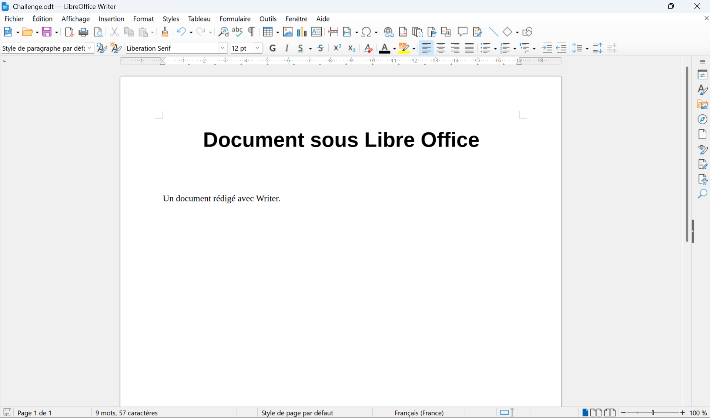
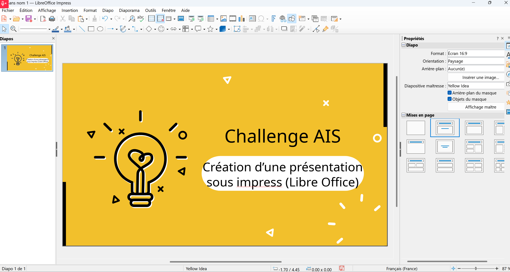

# Consignes üìù

* Installer et configurer Microsoft Office et LibreOffice sur votre machine ou sur une machine virtuelle ! (Office est dispo sur le drive)
* Créer un document, un tableur, et une présentation avec l’une des suites
* Tester la compatibilité des fichiers en ouvrant un fichier créé dans Microsoft Office avec LibreOffice et inversement
* Explorer les options de collaboration en ligne avec Microsoft Office (Office 365) ou LibreOffice (Collabora)
* Explorer le site https://www.clic-formation.net/
---
## Installation de Microsoft Office et Libre Office
### Installation sur une Machine virtuelle Window 11: 

---
## Document, tableur et présentation avec Libre Office:
### Writer:

### Calc:

### Impress:

---
Aucun problème lors de compatibilité à l'ouverture des fichiers sous Libre Office et Microsoft Office.
