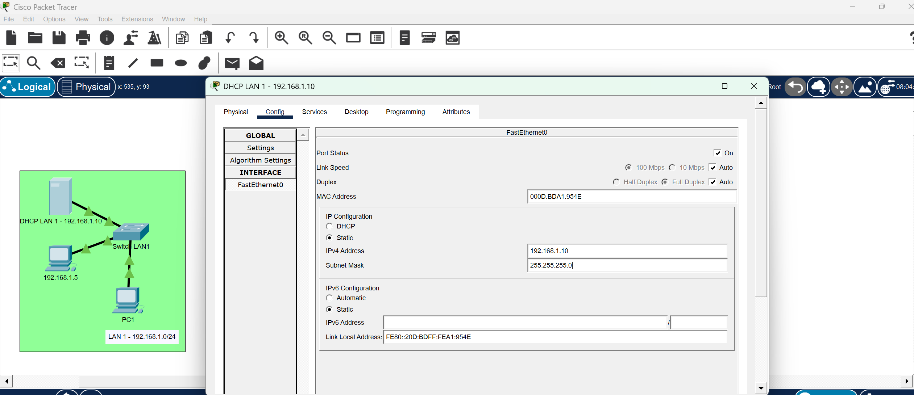
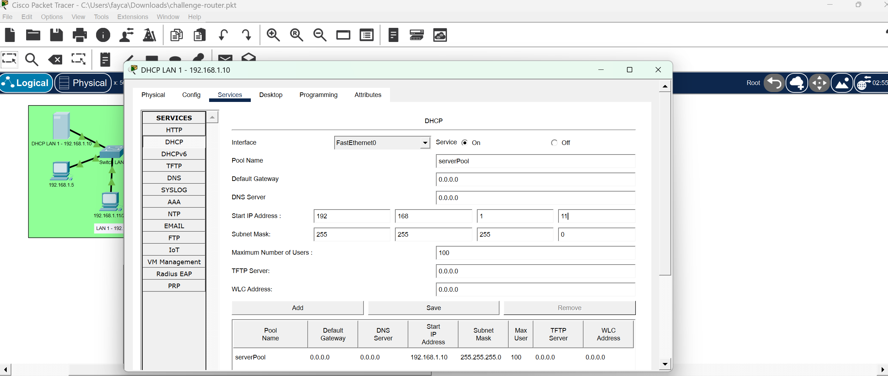
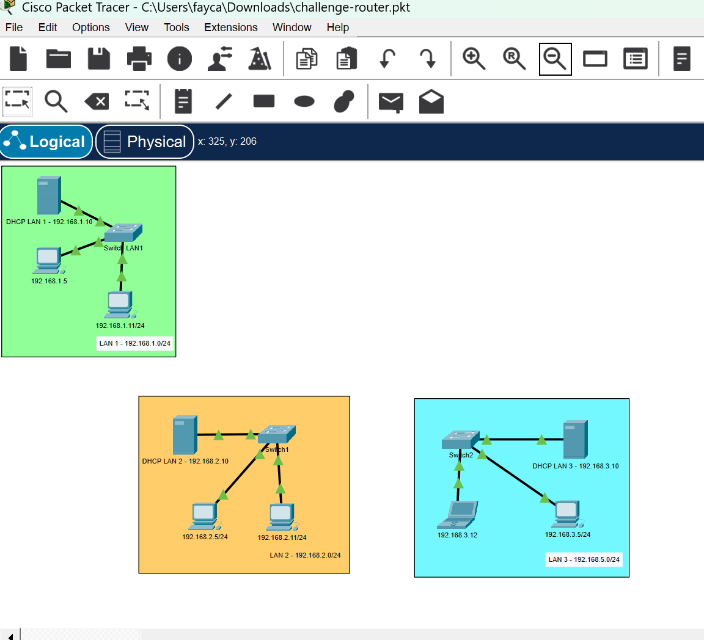
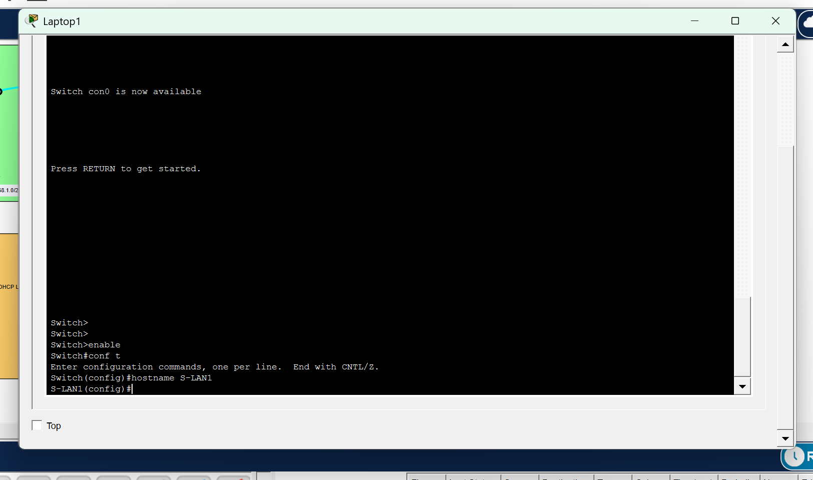
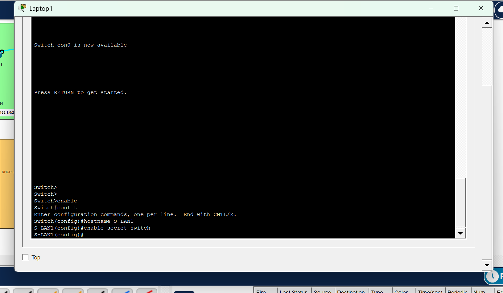
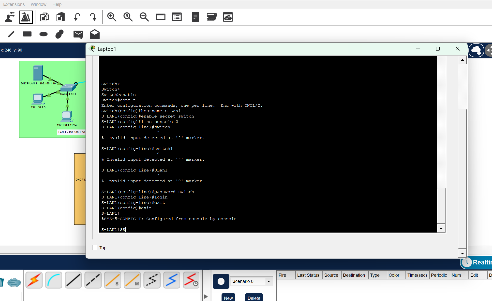
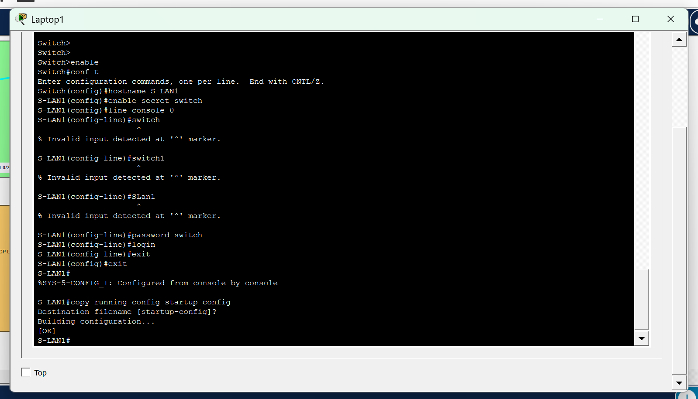
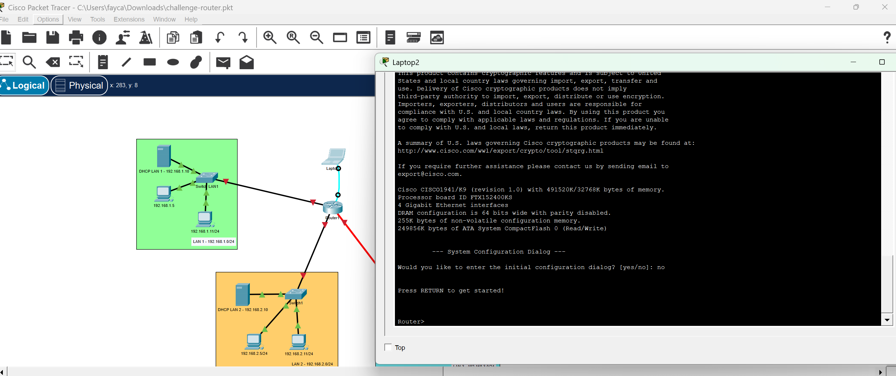
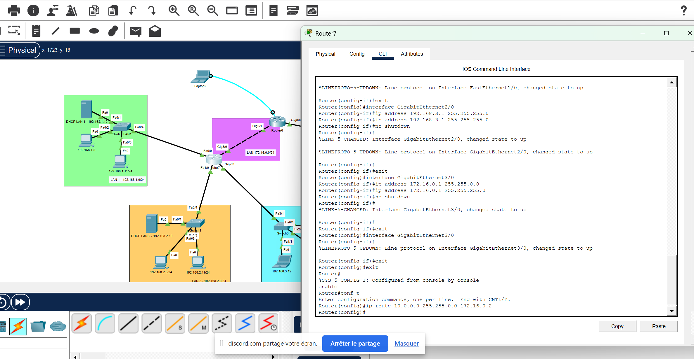

Ce soir, on pratique la configuration d’équipements Cisco, routeurs et switchs !

Étape 1 :
Créez 3 réseaux LAN, ajoutez dans chaque réseau :

Un PC fixe
Un switch Cisco 2960
Configurez l’IP de chaque PC (pour le PC, vous pouvez mettre .5 à chaque fois !), en suivant le plan d’adressage suivant :

LAN 1 : 192.168.1.0/24
LAN 2 : 192.168.2.0/24
LAN 3 : 192.168.3.0/24
Étape 2 :
Configurez le hostname et un mot de passe sur chacun des switchs de l’étape précédente.

Bonus : Configurez le DHCP (en mettant un serveur sur chaque LAN) sur l’ensemble des LANs ! Ajoutez un deuxième PC et vérifiez qu’il obtient bien une adresse et un masque de sous-réseau grâce au serveur DHCP.

Bonus : Configurez une adresse IP sur le Vlan1 du switch de chaque LAN.

Étape 3 :
Connectez les 3 LANs avec le routeur Cisco de votre choix 😉
Attention, il faudra pouvoir ajouter une autre interface sur le routeur plus tard, il aura donc 4 interfaces réseau à la fin.

Configurez le routeur pour que le ping passe entre les 3 LANs.

💡 Indice : le routeur devra avoir une adresse IP dans chacun des LANs. N’oubliez pas de configurer cette adresse comme passerelle sur les machines dans le LAN correspondant !

Étape 4 :
Créez un nouveau LAN, en 10.0.0.0/16, avec un PC fixe à l’intérieur (mettez-lui l’adresse de votre choix sur ce sous-réseau).

Reliez ce LAN au routeur existant en passant par un routeur Cisco 1941. Il y aura donc un cinquième sous-réseau entre les deux routeurs (vous pouvez utiliser l’adressage 172.16.0.0/24 pour ce cinquième sous-réseau, par exemple).

Voici ce que vous devez obtenir dans Packet Tracer :

Configurez le nouveau routeur et le routeur existant pour que le ping passe entre les 4 LANs.

💡 Indice : il faudra faire une route statique ou une route par défaut sur les deux routeurs. À vous de trouver ce qui fonctionne comme règle !

---

Création du premier LAN :
J’ai ajouté DHCP et un ordinateur supplémentaire comme demandé dans la partie bonus.
- Ajout d’une adresse IP fixe au serveur et configuration du serveur DHCP:

- Configuration du pc supplémentaire en ip DHCP :

Le PC obtient une adresse IP dans la plage définie : 192.168.1.0/25
Il est donc bien dans le meme sous réseau. Le ping fonctionne entre toutes les machines.

- J’ai procédé de la meme manière pour créer le LAN 2 :

- Puis le LAN 3, avec un laptop en DHCP :

- J’ai configuré un hostname et mot de passe pour chaque switch. Pour cela j’ai simulé une connection entre un ordinateur portable et le switch à l’aide du cable console.
- Dans le terminal j’ai entré les commandes enable, puis conf t :

- J’ai entré la commande hostname suivi du nom de mon switch :

- Ajout du mot de passe (enable secret + mot de passe):

-  Ajout d’un mot de passe à la connexion :

- Sauvegarde :

- J’ai effectué les memes manipulations pour les deux autres switch.
 Ajout d’un routeur afin de connecter les 3 réseaux  et Configuration des ports du router :

- J’ai configuré les passerelles par défauts du DHCP et des PC :

-  J’ai ajouté le nouveau routeur et crée les nouveaux sous réseaux :

- J’ai crée une route statique avec la commande ip route :

- J’ai crée le reste des routes statiques de mon réseau :

- Toutes les machines peuvent désormais communiquer entre elles :

