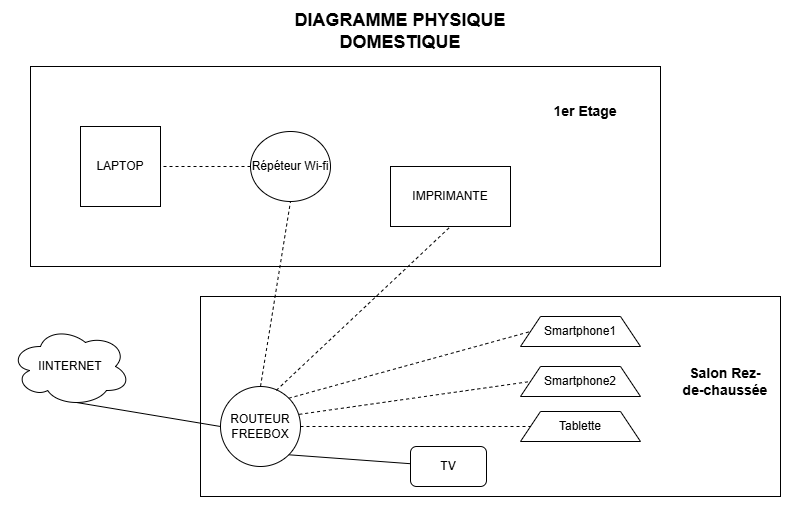

# Challenge : Création de Diagrammes Réseau Physique et Logique

**Énoncé :** "Avec l’outil de votre choix (draw.io, par exemple) tentez de réaliser un diagramme réseau de votre réseau domestique.Essayez de n’oublier aucun équipement connecté au WiFi ou en filaire à votre box !"

## 🛠️ Outils Utilisés:
 Draw.io

## Diagramme Physique

## Diagramme Logique

.png)

