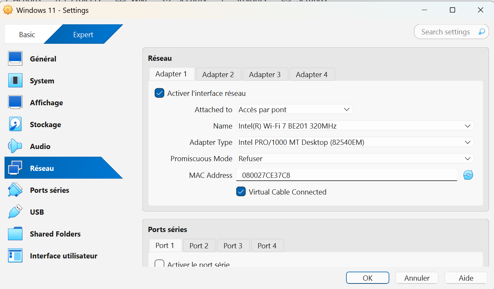
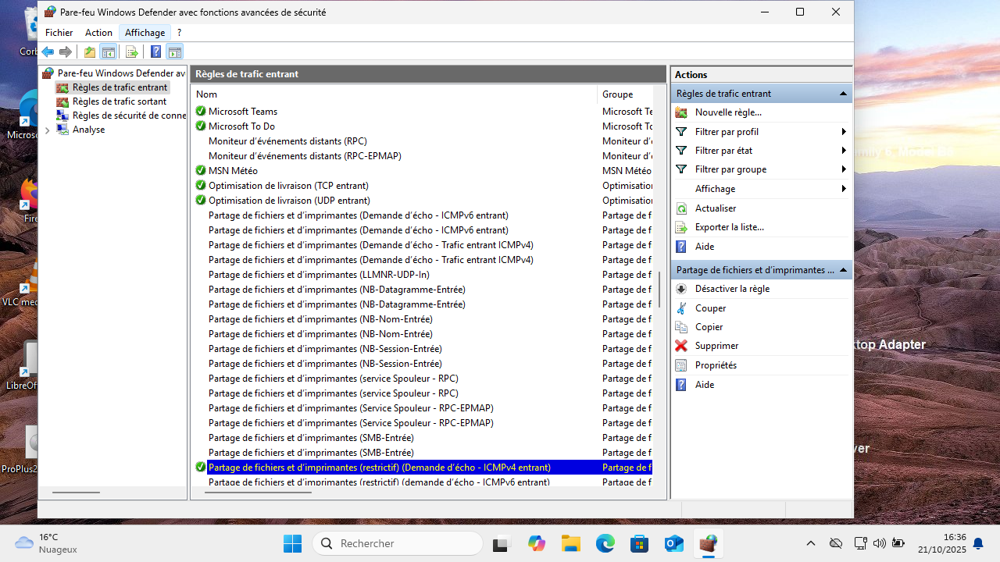

# 📝Consignes du challenge :
Actuellement, sur Windows 10 et Windows 11, il est impossible de pinguer vos machines virtuelles (VM) depuis votre ordinateur hôte (votre PC personnel) sous VirtualBox.

Votre tâche consiste à permettre à votre machine hôte d’effectuer un ping vers vos VM Windows.
En d’autres termes, vous devez configurer votre environnement de manière à rendre vos VM accessibles en réseau depuis votre poste principal.

---

# Configuration du réseau des Machines virtuelles sur VirtualBox:

Dans réglages de la machine virtuelle, puis réseau j'ai selectionné l'option "accès par pont" et j'ai selectionné la carte réseau de ma machine Hote. Exemple avec Windows 11:

Etant de base connecté à un répteur wifi, j'ai connecté mon hote directement en wifi à la BOX.

---

 ## Pour les machines virtuelles Windows 10 et 11:
- J'ai été dans les paramètres avancés du par-feu pour autoriser le ping et j'ai activé la règle : "Partage de fichiers et d'imprimantes (Demande d'écho - ICMPv4-In):
  

La commande "ipconfig" m'a permis de connaitre l'adresse IP de la VM et le ping à partir de l'hote vers la machine virtuelle fonctionne avec succès :

 ## Pour les machines virtuelles Ubuntu et Debian:

- La commande "ip a"  m'a permis de connaitre l'adresse IP de la VM et le ping à partir de l'hote vers la machine virtuelle fonctionne avec succès:

  
  

  

