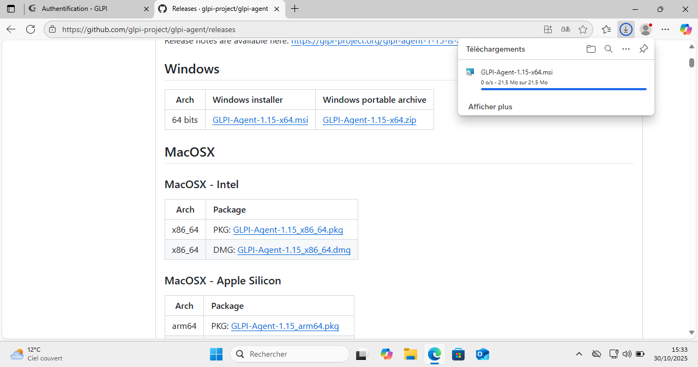
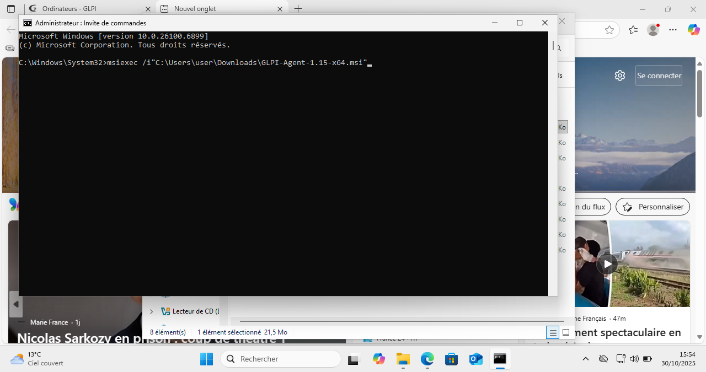
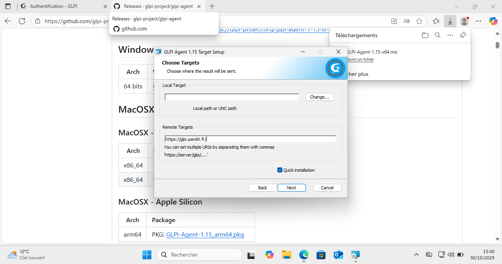
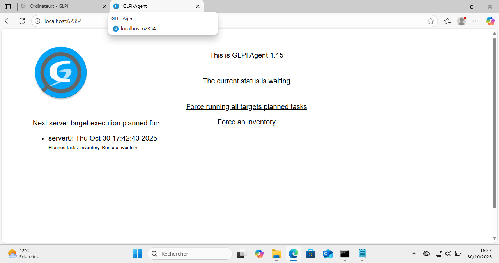

# Consignes 🗒️
Installer le GLPI Agent sur une machine virtuelle (ou plusieurs, si vous voulez aller plus loin).

L’objectif est que vos machines remontent correctement leurs informations dans votre instance GLPI (inventaire matériel, logiciels, etc.).

Vérifiez que la communication entre l’agent et le serveur GLPI fonctionne bien.

Tester la gestion des tickets dans GLPI :

Créez quelques tickets pour simuler des demandes utilisateurs.

Testez le cycle de vie complet d’un ticket : création, attribution, suivi, clôture.

Explorez les fonctionnalités utiles au support : ajout de commentaires, changement de statut, notifications, etc.

---
## 1. Installation avec droits administrateur

* Téléchargement de l'agent GLPI:
  
  
  
*  Ouverture de l'**Invite de commande (cmd) en tant qu'administrateur**.
  
*  Lancement de l'installateur avec les droits complets via la commande :
    ```bash
    msiexec /i + "chemin"
    ```
    
## 2. Configuration de l'agent

Pendant l'installation :

*  Choix du mode **"Quick Installation"**.
*  Saisie de l'URL du serveur (`https://glpi.pandit.fr/`) dans le champ **"Remote Target"**:

  
  
*  Finalisation de l'installation.

## 3. Forcer l'inventaire

*  Ouverture d'un navigateur web sur la VM et accès à l'interface locale de l'agent.
    (L'adresse `http://localhost:62354` a été trouvée dans les logs de l'agent (`C:\Programmes\GLPI-Agent\logs\`).)

   
*  Clic sur le bouton **"Force an inventory"**.

## 4. Vérification de l'identité

L'ordinateur est apparu dans GLPI:


