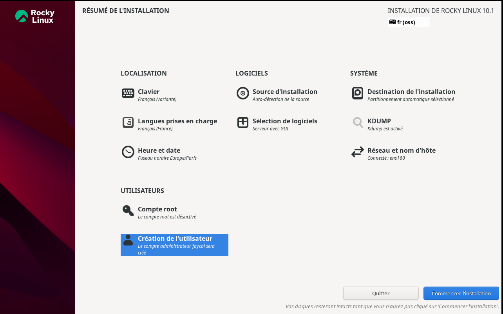
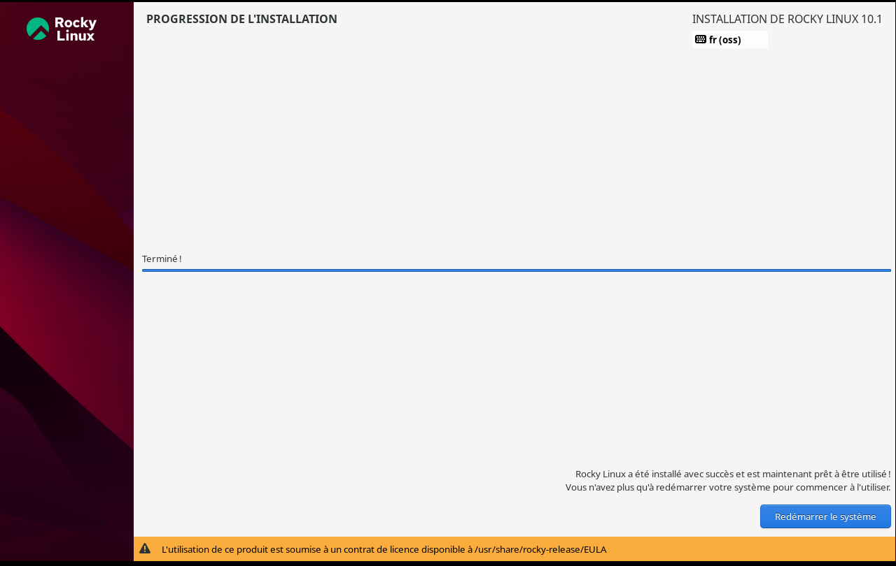
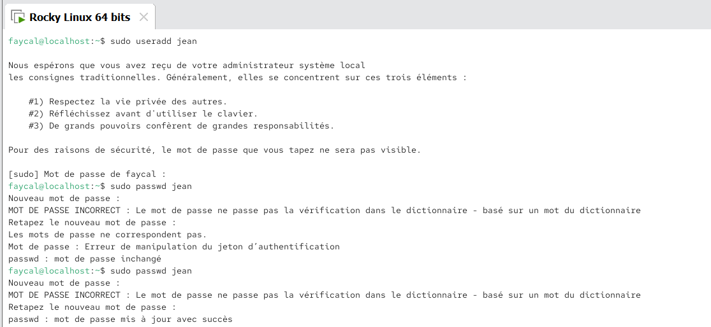
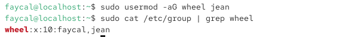

# Consignes 🗒️:

Pour pratiquer les notions du jour, votre mission est d’installer une VM Rocky Linux (le successeur de CentOS, la version communautaire de Red Hat Entreprise Linux).

Sur cette VM, vous devez :

créer un nouvel utilisateur
permettre à cet utilisateur de lancer des commandes avec sudo
faire en sorte qu’aucun mot de passe ne soit demandé pour lancer la commande rpm
créer un groupe, mettre le nouvel utilisateur et l’utilisateur créé lors de l’installation dans ce groupe
créer un dossier /home/partage_fichier et modifier ses permissions pour que les membres du groupe créé précédemment aient les droits de lecture et d’écriture, mais qu’aucun autre utilisateur du système n’y ait accès.
créer un dernier utilisateur et vérifier qu’il n’a pas accès au dossier créé précédemment

----

# Installation de la VM :

# Création du nouvel utilisateur :

# Permettre à l'utilisateur d'utiliser les commandes sudo :

# Ne pas demander de mot de passe pour lancer la commande rpm :

