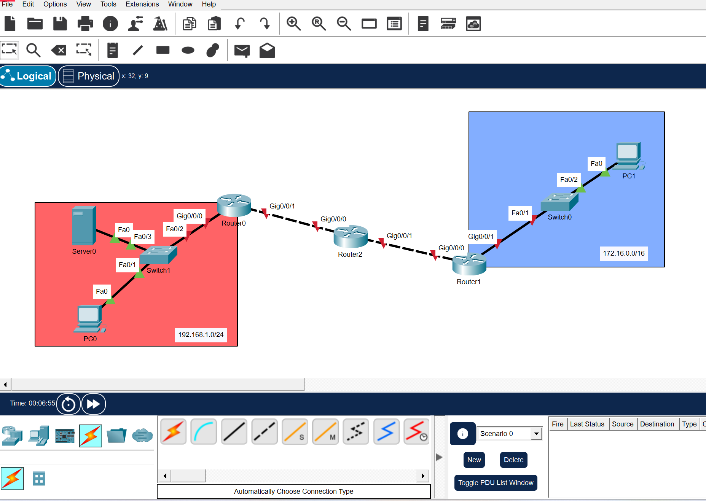
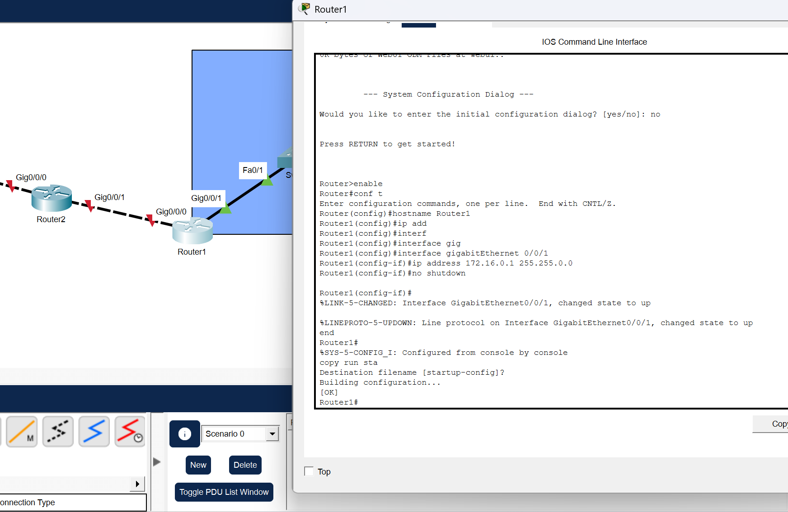
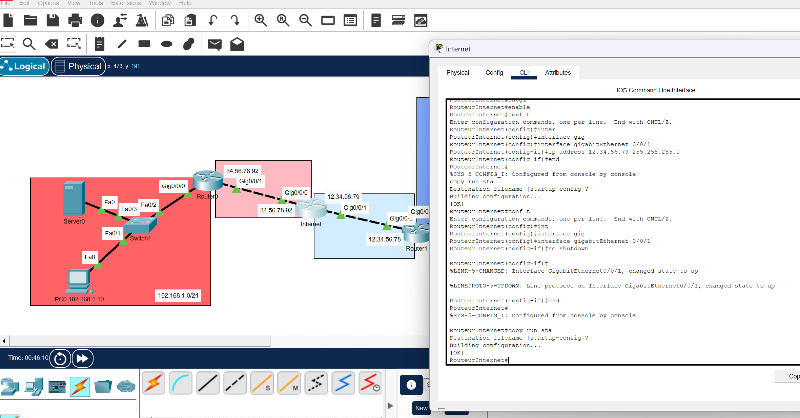
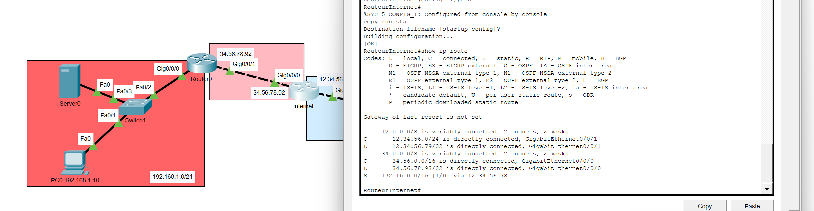
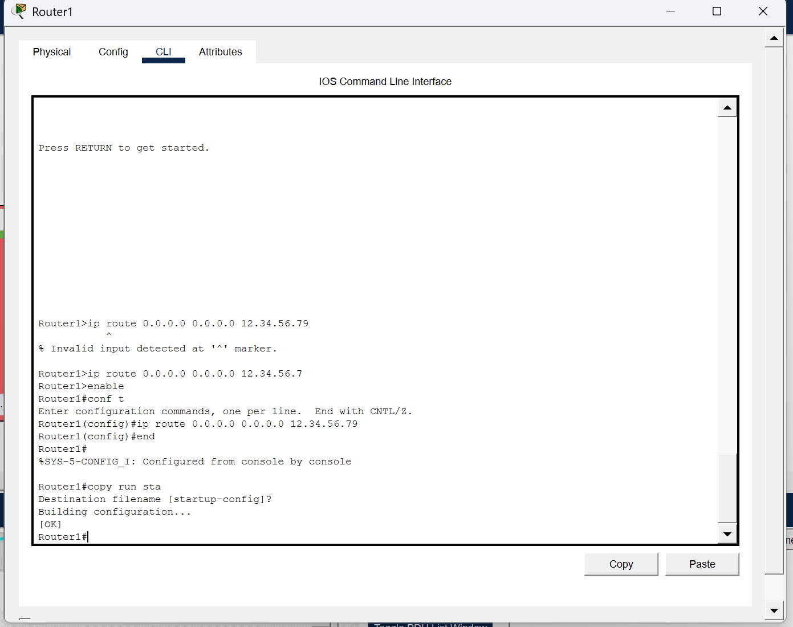
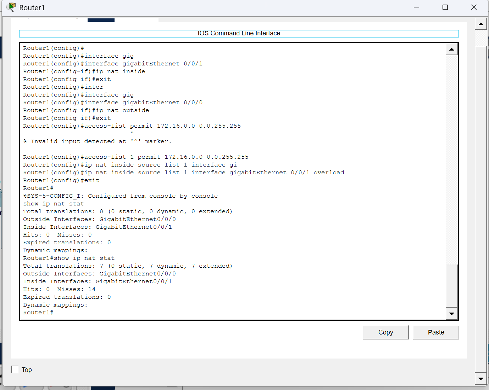
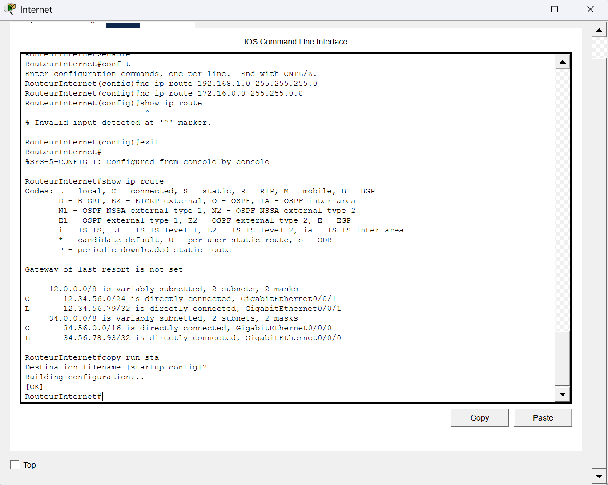
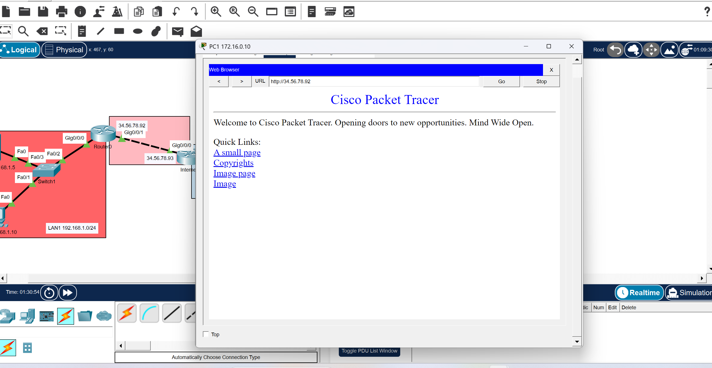

# Consignes :🗒️

Créez un nouveau projet Packet Tracer, puis :

- créez deux LANs, un en 192.168.1.0/24 et un en 172.16.0.0/16 (par exemple)
- ajoutez un routeur de bordure (une « box » !) dans chaque LAN
- ajoutez un (ou plusieurs) routeur(s) pour interconnecter les deux LANs (et représenter Internet)
- créez les routes nécessaires
- activez le NAT sur les routeurs de bordure
- mettez un serveur dans un des deux LANs
- créez une redirection de port et testez d’accéder à votre serveur web depuis l’autre LAN !

---

- Configuration des adresses IP et passerelles par défaut :

- Ajout des passerelles par défaut pour les différents routeurs :

- Ajout de deux routes statiques dans le routeur Internet :

- Ajout de routes par défaut aux routeurs du Lan 1 et du lan 2 :

Les Machines des deux Lan peuvent désormais communiquer, les ping fonctionnent.

- Activation du NAT sur les routeurs de bordure :

- Suppression des deux routes statiques sur le routeur « Internet »

- Ajout de la redirection de port pour le serveur, tout fonctionne :
  

