🛠️ Installation et Configuration de Veeam Backup & Replication
Pour cet exercice, j'ai procédé à l'installation du serveur de sauvegarde Veeam sur une machine virtuelle Windows 10 Pro, hébergée sous Proxmox.

1. Création de la Machine Virtuelle (Proxmox)
Création d'une VM Windows 10 respectant les prérequis du TP pour supporter la charge de Veeam:

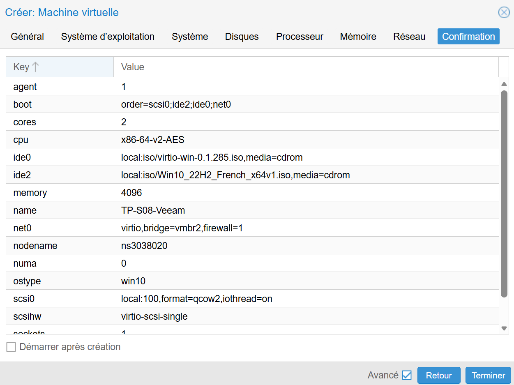

2. Configuration Initiale de Windows & Clonage d'une deuxième VM
Après l'installation standard de Windows 10, j'ai éffectué plusieurs choses.

A. Activation du compte Administrateur
Pour respecter les consignes de sécurité et avoir les pleins droits, le compte Administrateur intégré a été activé via l'invite de commande :

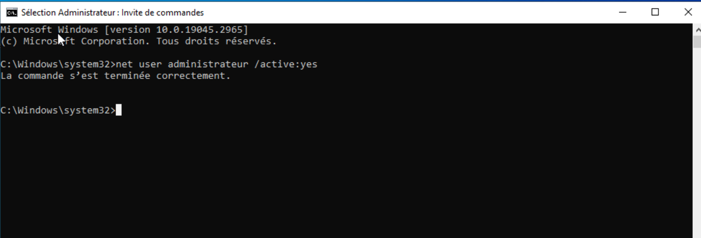

```net user administrateur /active:yes```

```net user administrateur * ```

B. Clonage pour le futur client
Avant d'installer Veeam, une VM TP-S08-Win10Client a été clonée pour créer le futur poste client.


3. Configuration du Serveur Veeam

A. Renommage et IP Statique

Nom de la machine : Veeam

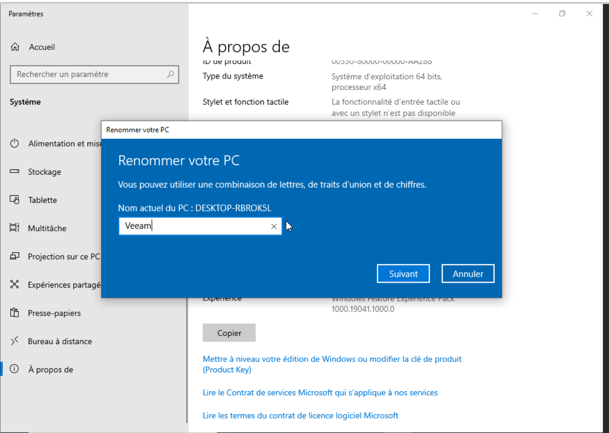

Adressage IP : Statique

IP : 10.0.1.3

Masque : 255.255.0.0 (/16)

Passerelle : 10.0.0.1

DNS : 10.0.0.1 

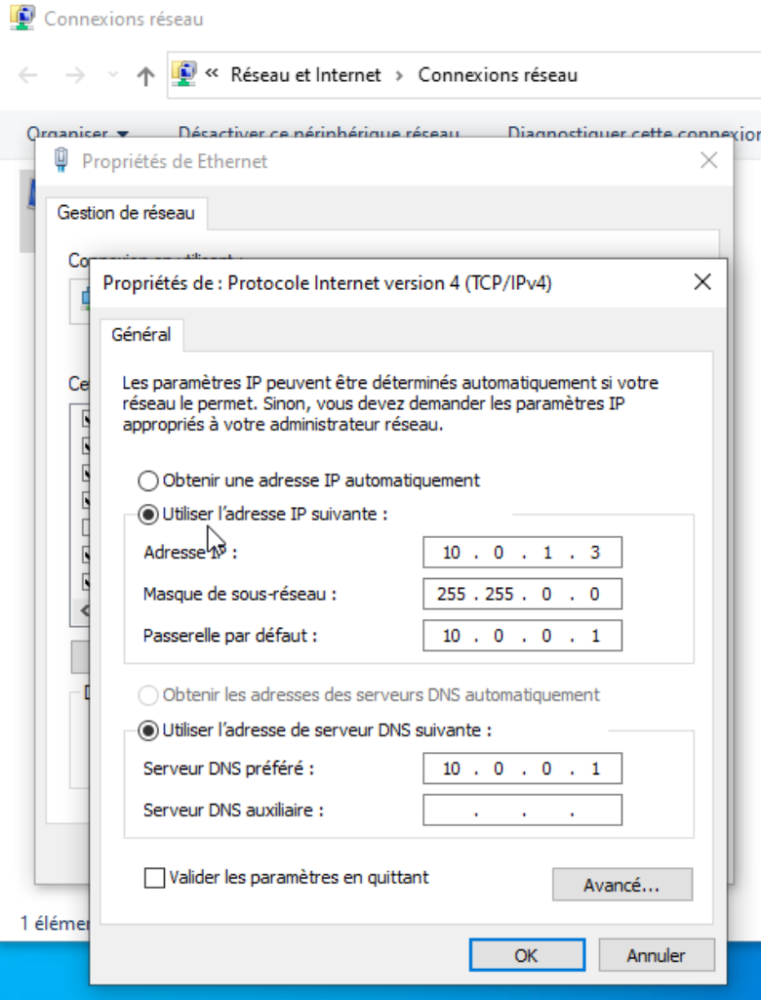

4. Installation de Veeam Backup & Replication

L'installation a été réalisée à partir de l'image ISO montée directement via le lecteur CD virtuel de Proxmox:


Compte de service : LOCAL SYSTEM account (Par défaut)

Base de données : PostgreSQL (Installé automatiquement)

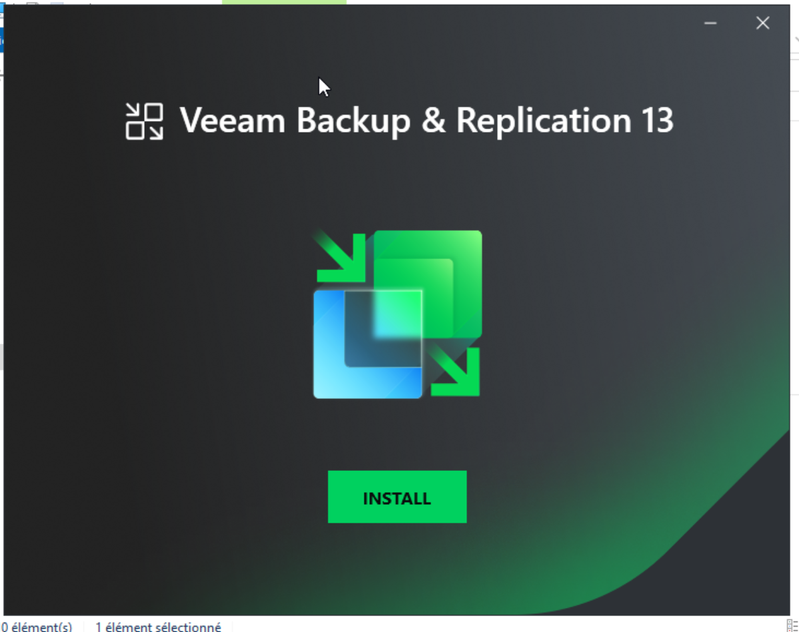

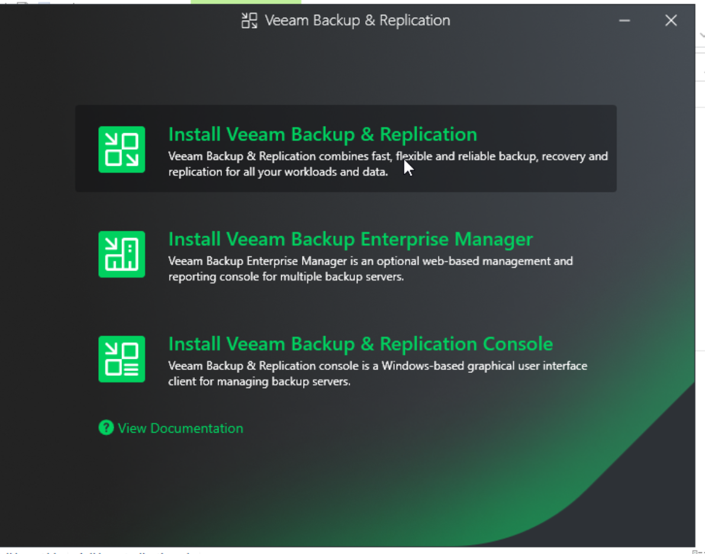

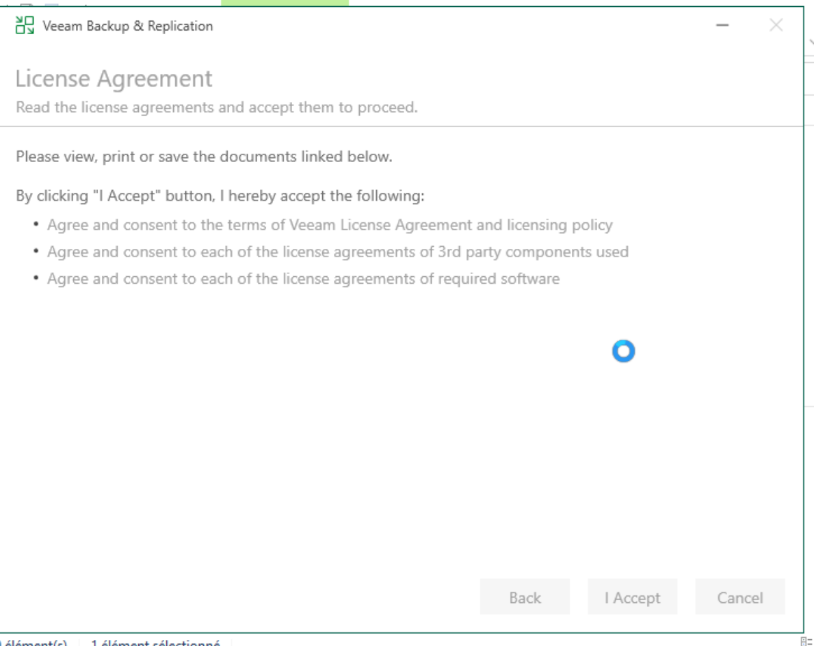

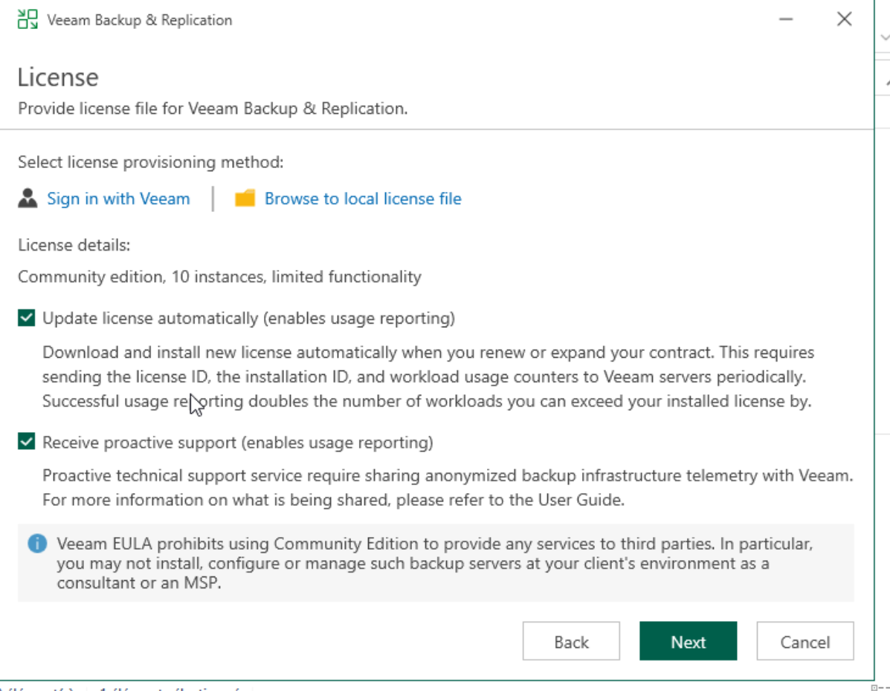

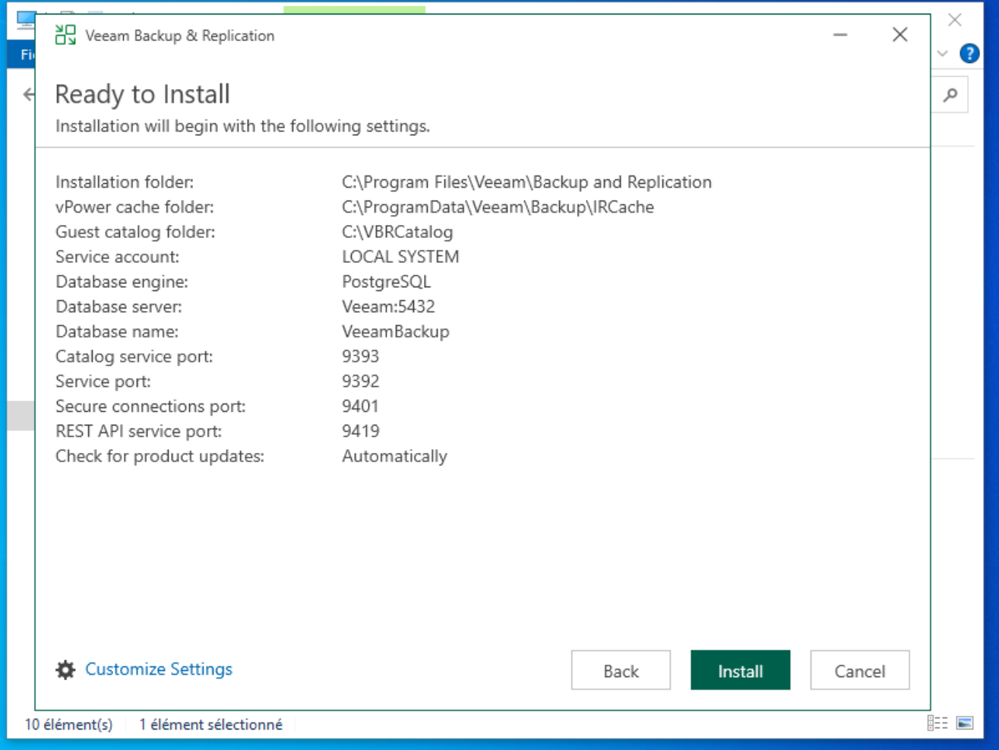

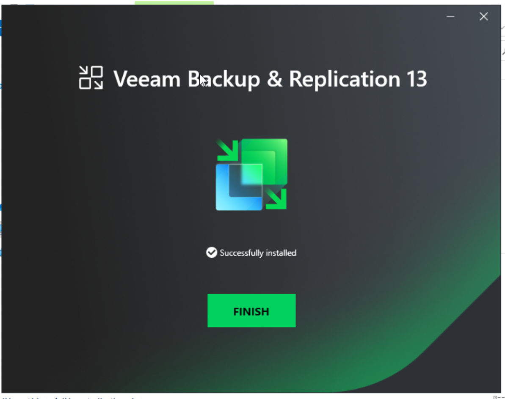


5. Validation
L'installation s'est terminée avec succès. L'accès à la console Veeam est fonctionnel via l'écran de login:

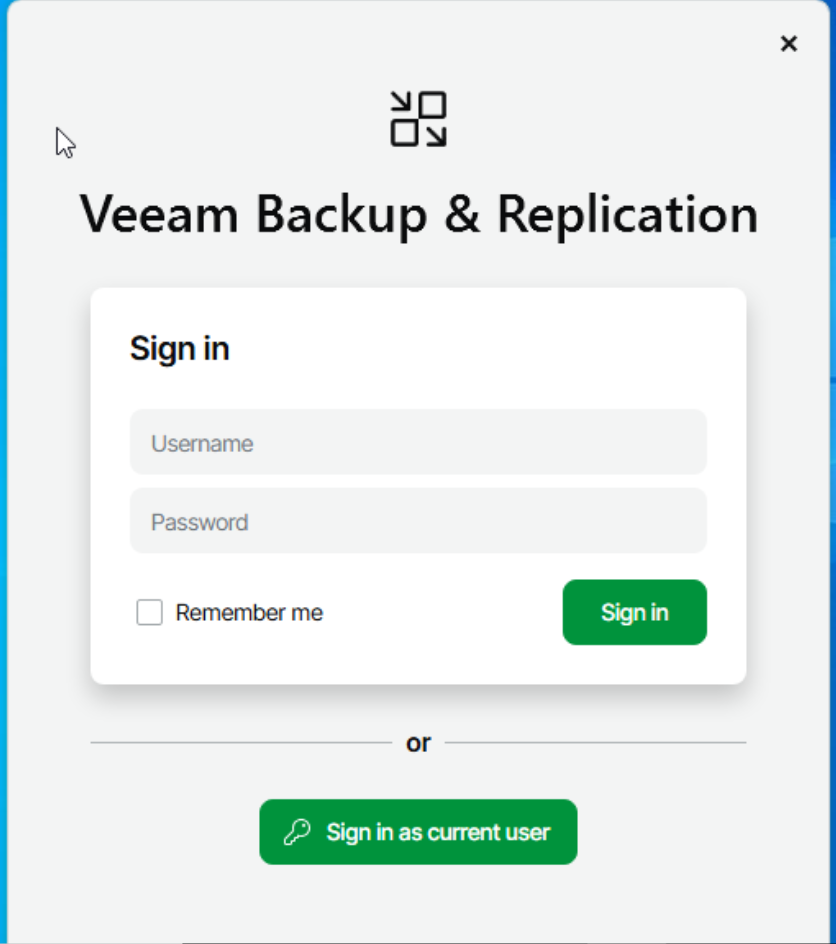

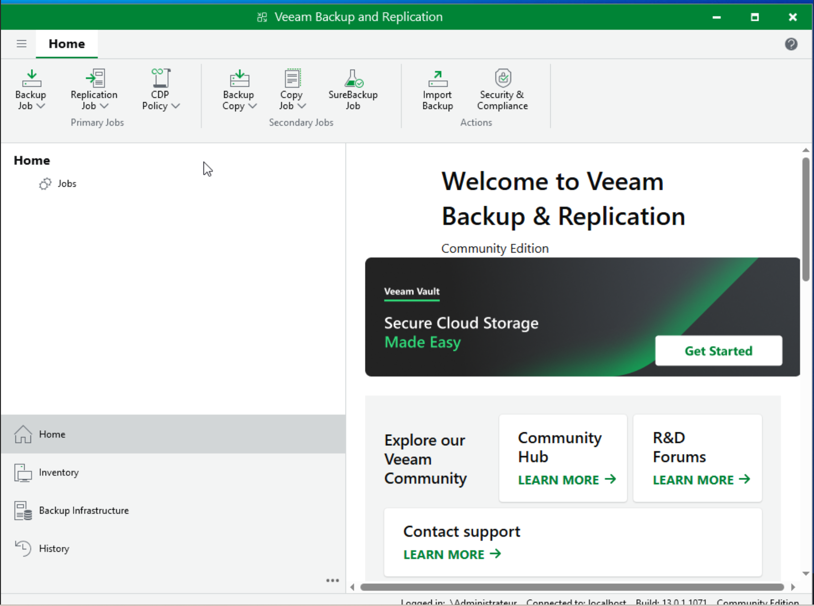
