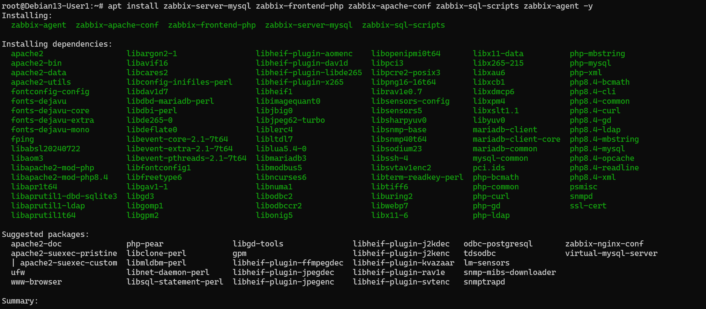
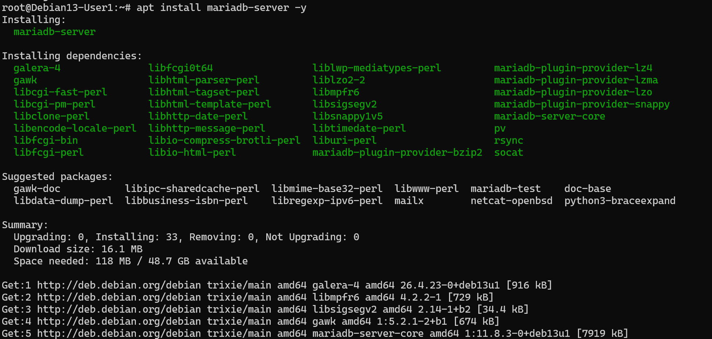
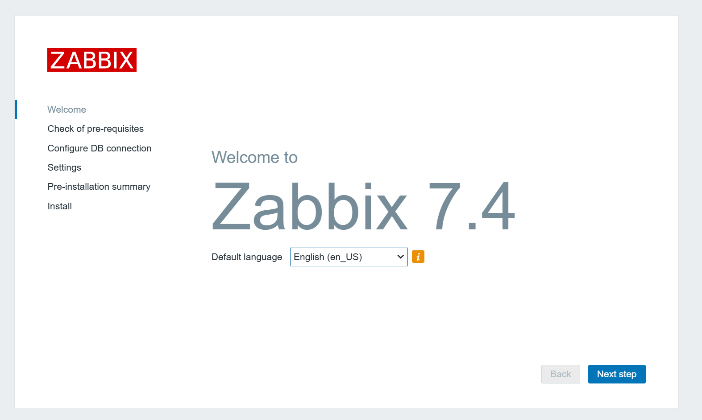
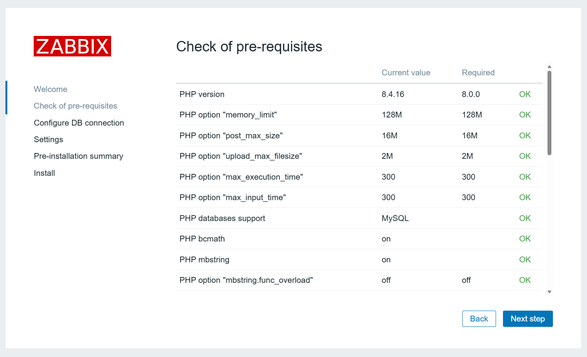
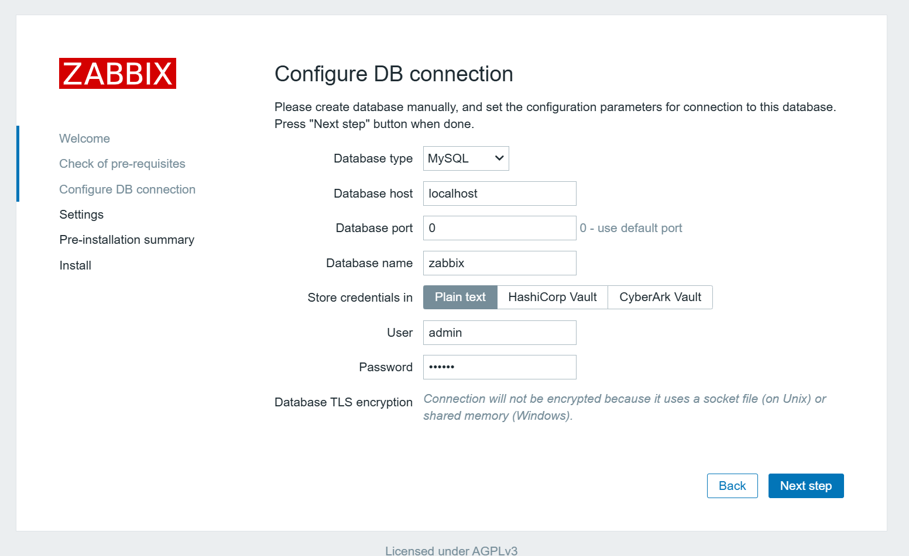
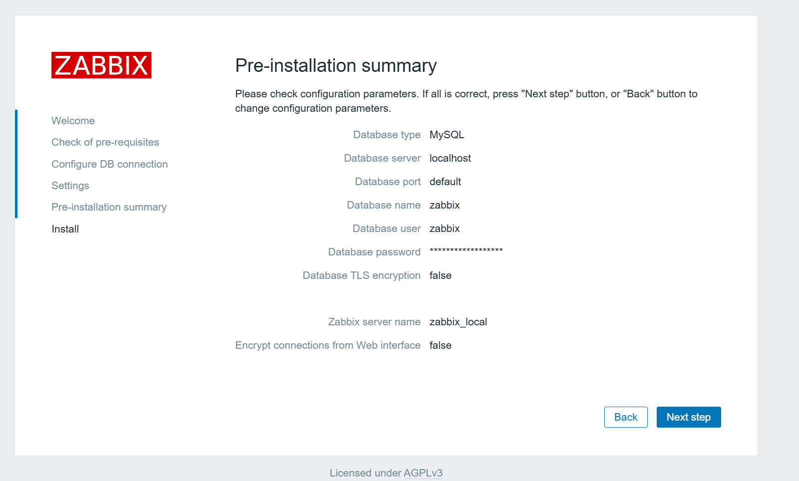
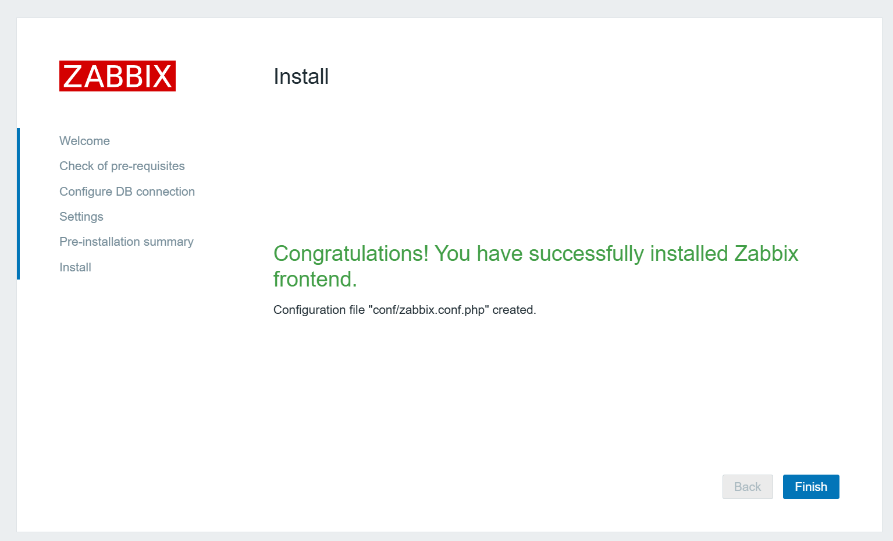
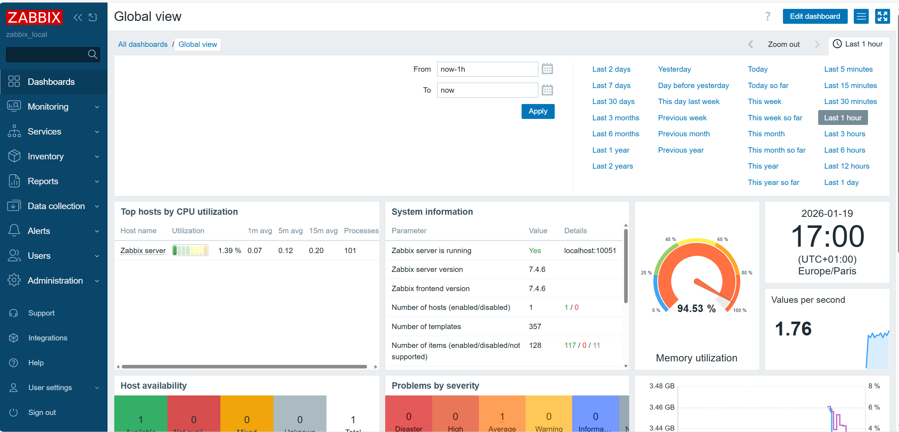

# Challenge : Mise en place d'une supervision Zabbix

**Objectif :** Déployer un serveur de supervision centralisé pour monitorer une infrastructure.

## Environnement technique
* **Virtualisation :** Proxmox (Conteneur LXC)
* **OS :** Debian 13 (Trixie)
* **Solution :** Zabbix 7.4.6
* **Base de données :** MariaDB

## Étapes de réalisation

### 1. Préparation du Conteneur
Création du conteneur Debian 13 sur Proxmox avec 4 Go de RAM.
Mise à jour complète du système et installation des prérequis.


### 2. Installation de Zabbix
Installation des paquets Zabbix Server, Frontend et Agent (Version 7.4).







### 3. Configuration Base de Données
Installation de MariaDB, création de la base `zabbix` et import du schéma initial.

```mysql -u root -p```

``` CREATE DATABASE zabbix CHARACTER SET utf8mb4 COLLATE utf8mb4_bin; ```
```CREATE USER 'zabbix'@'localhost' IDENTIFIED BY 'MotDePasseSecurise';```
```GRANT ALL PRIVILEGES ON zabbix.* TO 'zabbix'@'localhost';```
```SET GLOBAL log_bin_trust_function_creators = 1;```
```QUIT; ```

# Import des données

```zcat /usr/share/zabbix/sql-scripts/mysql/server.sql.gz | mysql --default-character-set=utf8mb4 -uzabbix -p zabbix```

# Édition du fichier de configuration

```nano /etc/zabbix/zabbix_server.conf```
On modifie la ligne DBPassword: 
```DBPassword=MotDePasseSecurise```

```sudo systemctl restart zabbix-server zabbix-agent apache2```
```sudo systemctl enable zabbix-server zabbix-agent apache2```

# Vérification du statut

```systemctl status zabbix-server```


### 4. Finalisation
Configuration du serveur via l'interface web et validation du fonctionnement (Statut Vert).
















