Configuration d'un conteneur Debian 12:

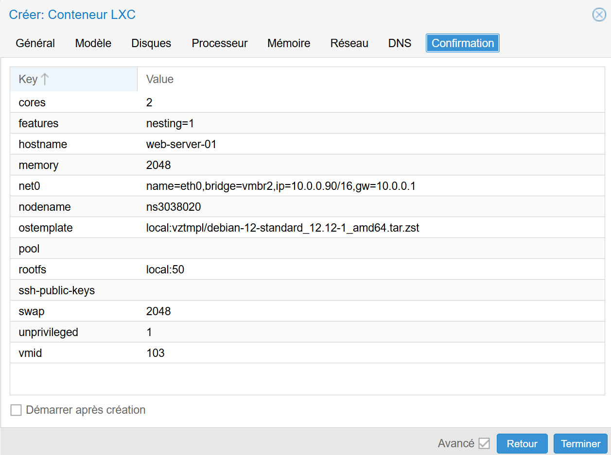

Le ping vers le serveur Zabbix fonctionne bien :

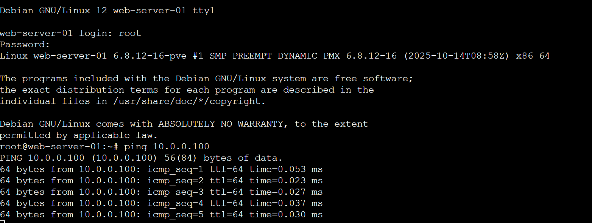

L'adresse IP est bien celle définie 10.0.0.90 :

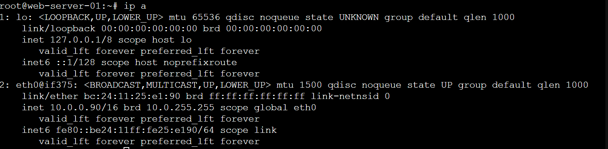

Mise à jour du système:

apt update
apt upgrade -y

Installation du service web:

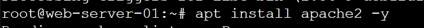
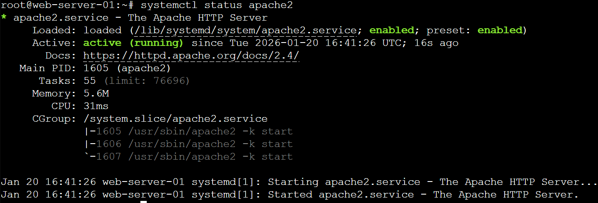

Le serveur client est bien accessible :

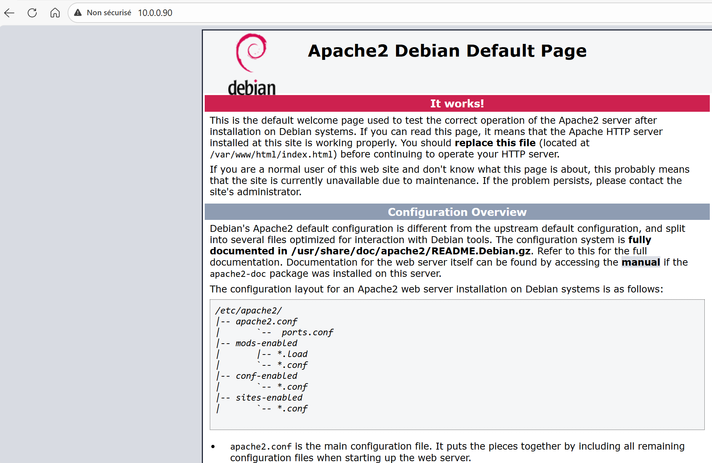

Ajout du dépôt Zabbix :

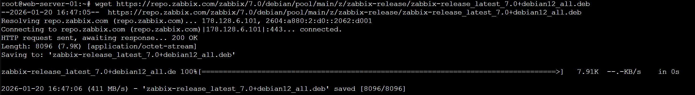

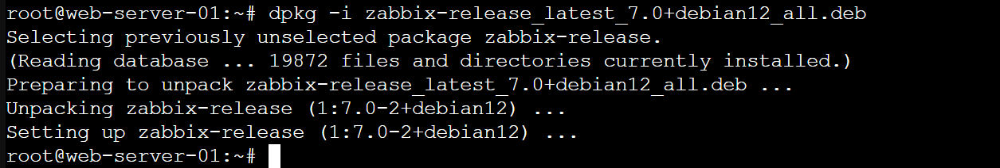

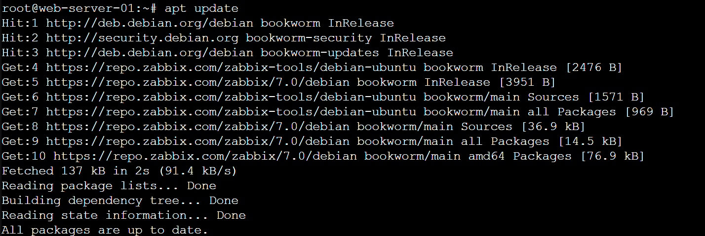

Installation de l'agent Zabbix 2 :

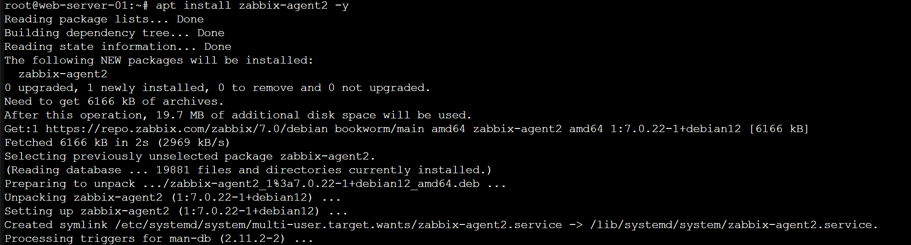

Edition du fichier de configuration :

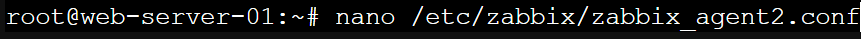

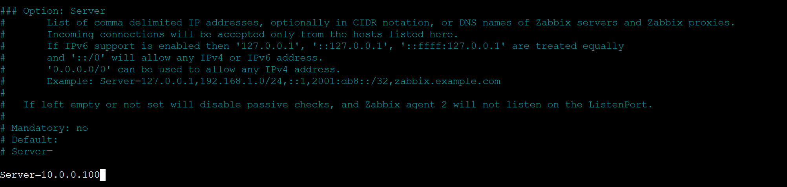

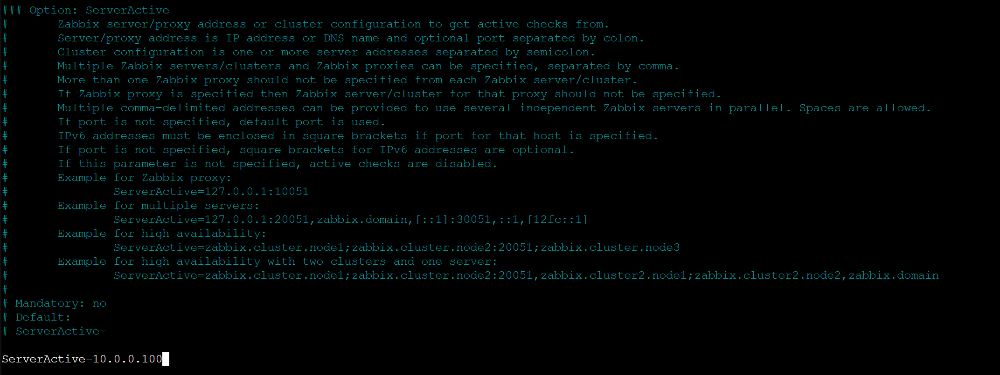

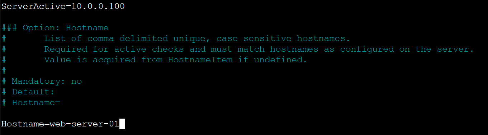

'''systemctl restart zabbix-agent2'''
'''systemctl enable zabbix-agent2'''
'''systemctl status zabbix-agent2'''

L'agent est bien démarré :

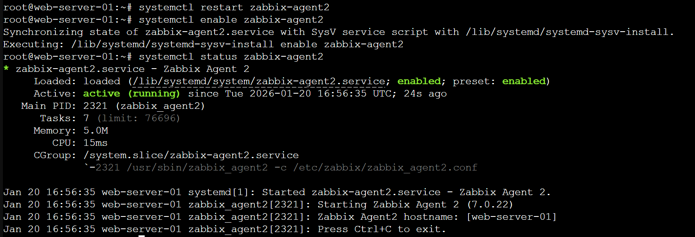

L'agent attend bien les connexions :

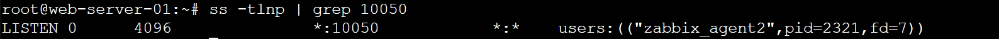

Déclarer le serveur client dans Zabbix, via l'interface :

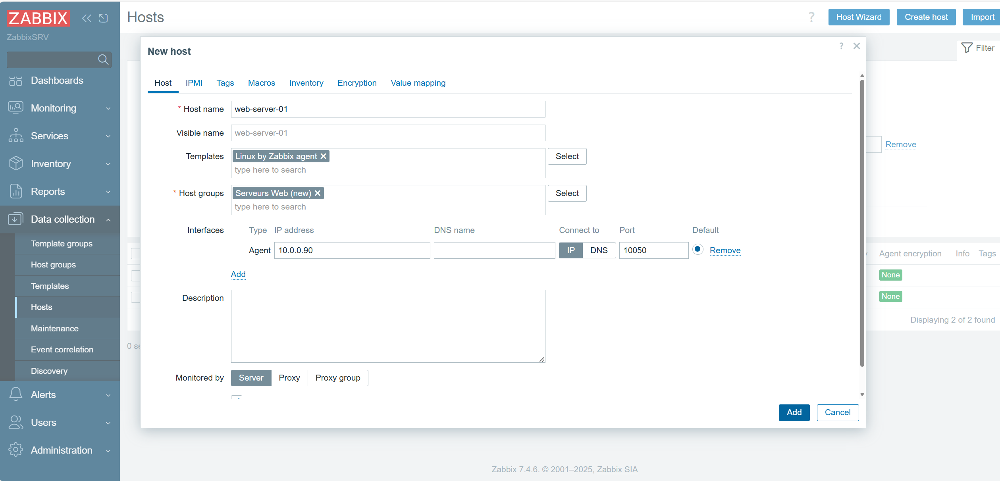

L'hote est bien disponible :

Création d'un nouveau Dashboard :

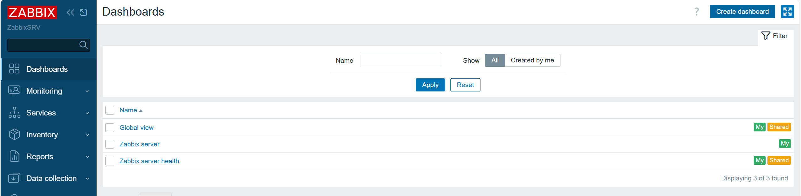

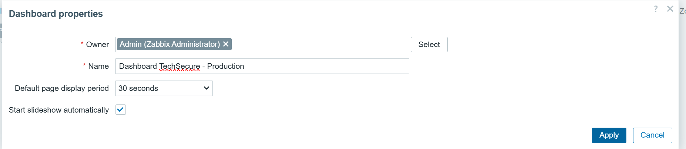

Ajout des widgets CPU, Mémoire, Disponibilité et Problèmes actifs :

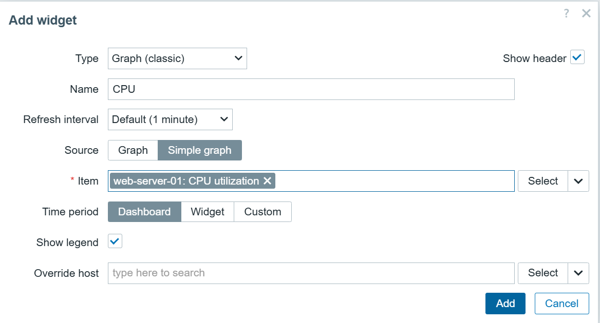

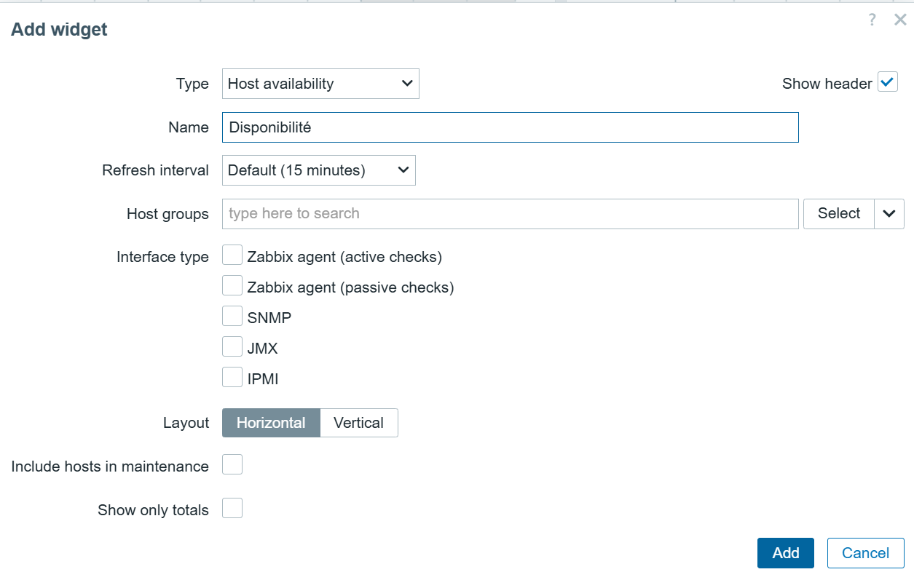
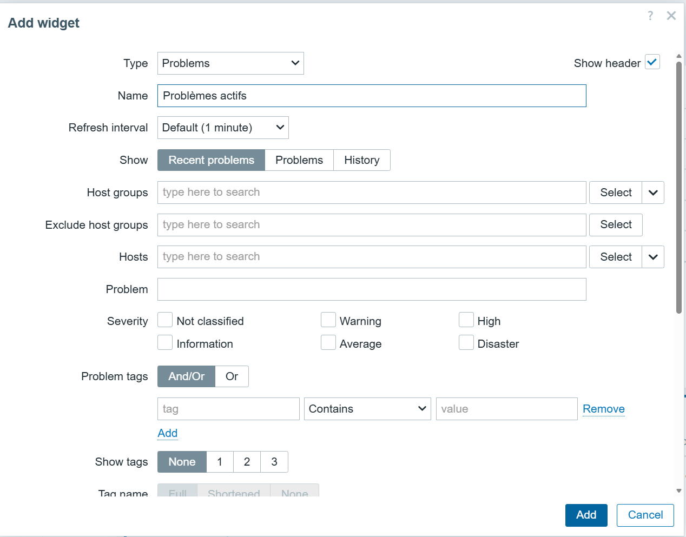

## Surveillance Critique de Fichiers :

Afin d'aller au-delà de la supervision standard (CPU/RAM), j'ai mis en place une règle de surveillance personnalisée.

**Objectif** : Détecter immédiatement la suppression accidentelle ou malveillante d'un fichier sensible (simulé ici par `C:\test.txt`) et lever une alerte critique.

### 1. Configuration de l'Item (Le Capteur)
Création d'un item utilisant la clé native de l'agent Zabbix pour interroger le système de fichiers.
* **Key** : `vfs.file.exists[C:\test.txt]`
* **Logique** : Retourne `1` si le fichier est présent, `0` s'il est absent.
* **Intervalle** : 30s pour une réactivité élevée (test).

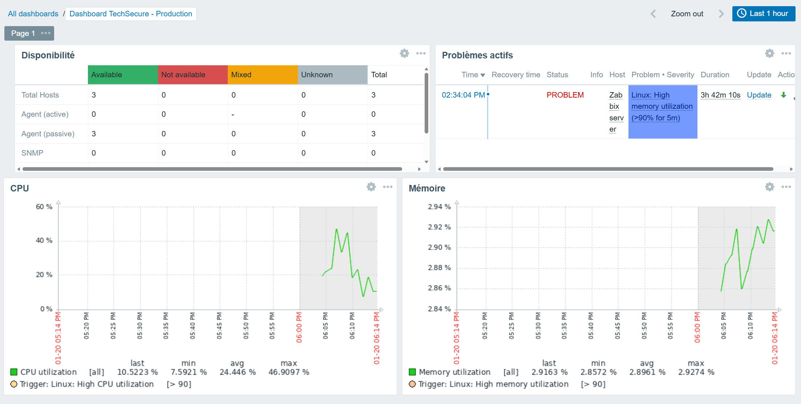

### 2. Configuration du Trigger (L'Alerte)
Mise en place d'un déclencheur avec une sévérité "High". L'expression vérifie la dernière valeur remontée par l'agent.
* **Expression** : `last(/DESKTOP-ARH9T3V/vfs.file.exists[C:\test.txt])=0`
* **Condition** : L'alerte se déclenche uniquement lorsque la valeur passe à 0 (fichier manquant).

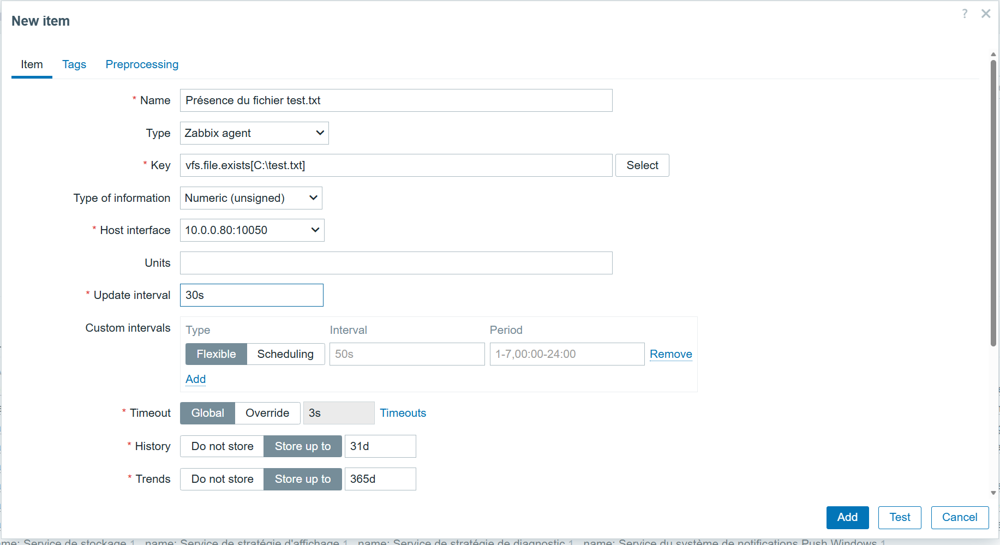

### 3. Simulation d'Incident et Résolution
Test effectué sur la VM Windows :

**Phase 1 : Incident**
Suppression manuelle du fichier cible. Zabbix détecte l'anomalie et passe le statut en **PROBLEM** (Sévérité High).
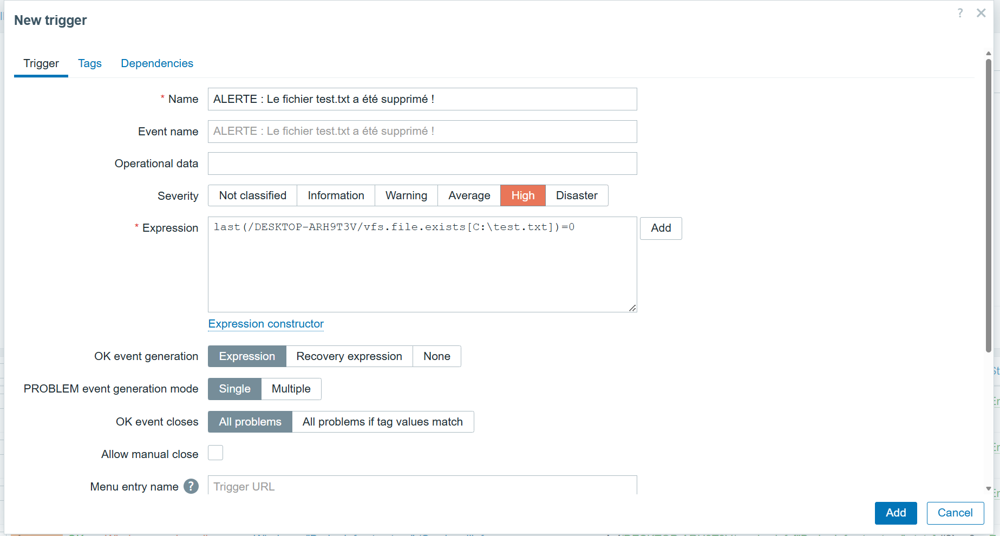

**Phase 2 : Retour à la normale**
Restauration du fichier. Zabbix détecte la présence du fichier au scan suivant et clôture automatiquement l'incident (**RESOLVED**).
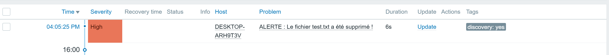

