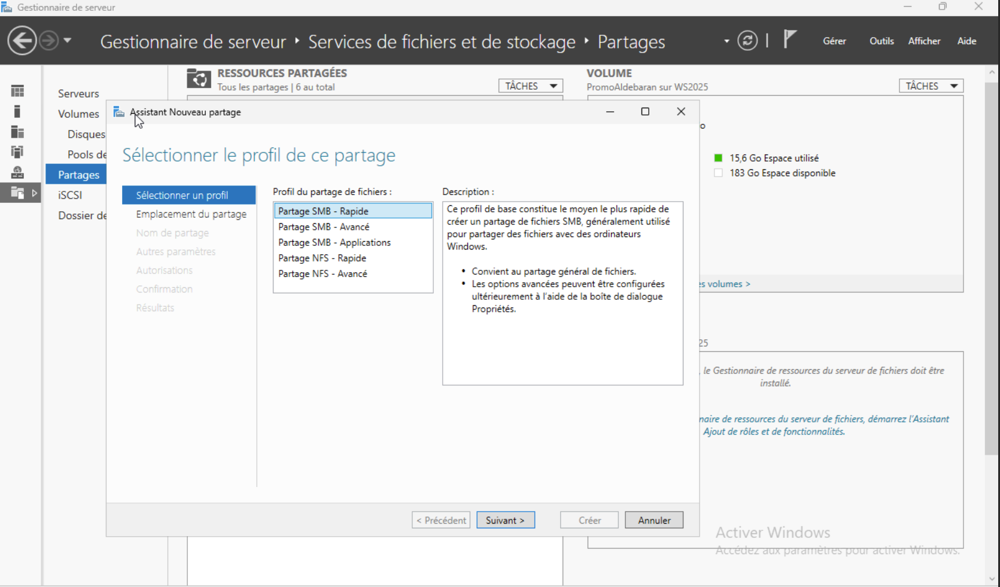
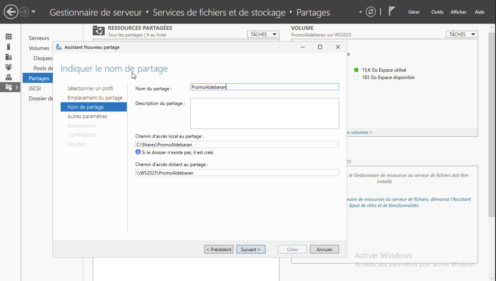
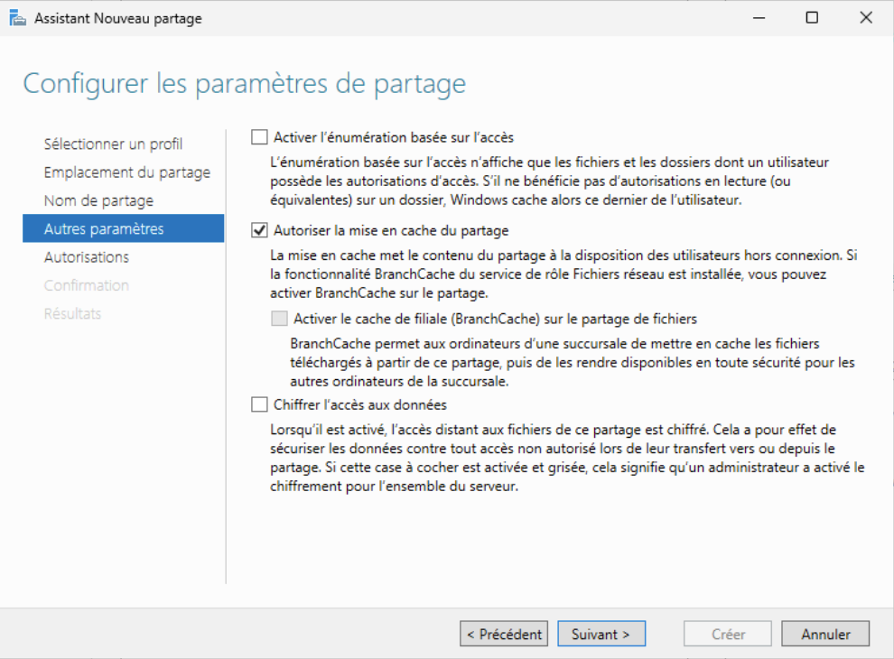
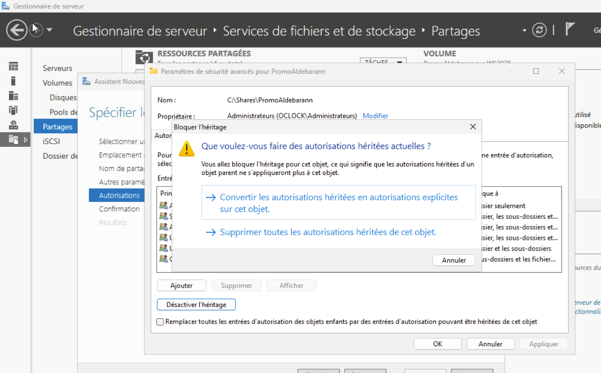
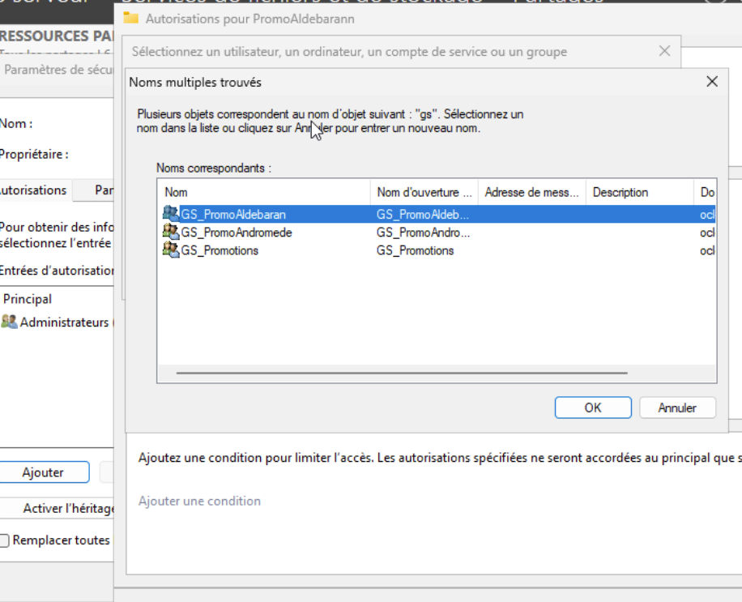
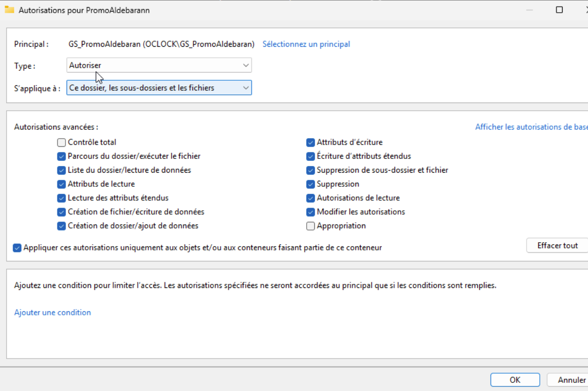
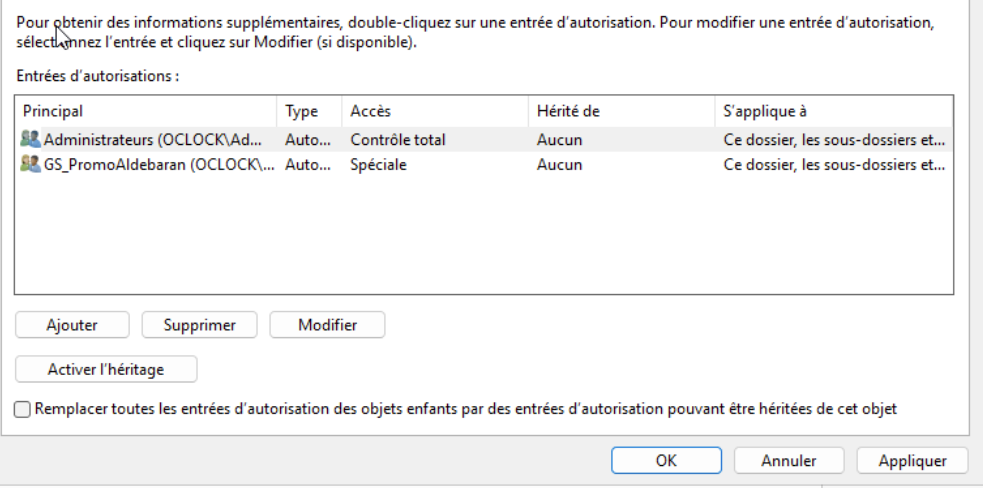
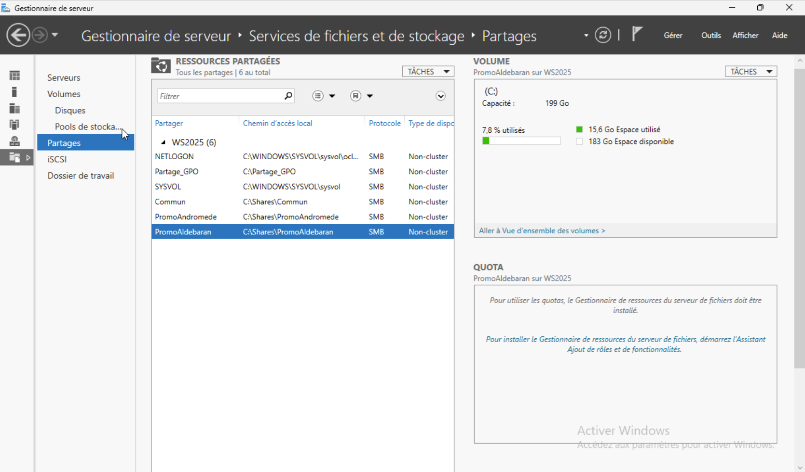

# Consignes 🗒️ :
Créer des dossiers de partage avec des autorisations aux différentes promotions Andromède et Aldébaran.

---

# Dans partage -> nouveau partage -> Partage SMB - rapide:

# Emplacement du partage -> Volume C: 

# Ajout du nom de partage PromoAldebaran : 

# Autorisation de la mise en cache:

# Personnalisation des autorisations -> Désactiver l'héritage -> Supprimer toutes les autorisations héritées de cet objet:

# Ajout du groupe et gestion des autorisations:

# Après confirmation les partages sont bien crées, les utilisateurs de chaque promotions peuvent accéder uniquement au dossier partagé de leur promo respectives:

## Un utilisateur membre du groupe GS_PromoAndromede peut uniquement accèder fichier PromoAndromede :

