# Consignes🗒️:
### Objectif de ce challenge : réussir à installer Windows Serveur (2022 ou 2025) sur une VM Proxmox !
Il faudra également ajouter le rôle Active Directory et promouvoir votre serveur en contrôleur de domaine.
Une fois que c’est fait, créez un ou deux utilisateurs (dans une OU « Utilisateurs », par exemple) puis essayez de rejoindre le domaine depuis une VM Windows 10 et essayez ensuite de vous connecter avec l’un de vos utilisateurs !

---

# Installation de Windows Serveur 2022 et configuration du nom de la machine:

Une fois le serveur installé, renommer le PC:
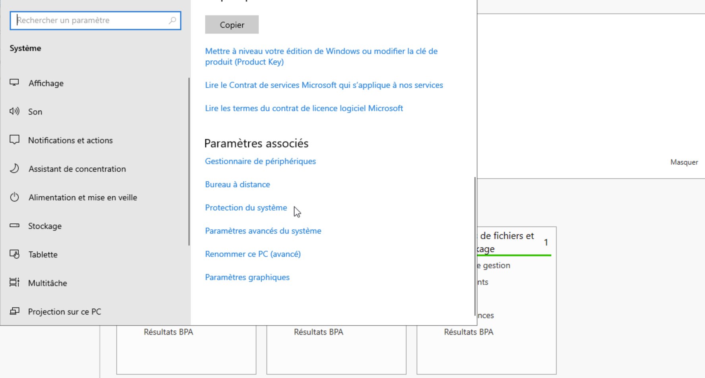

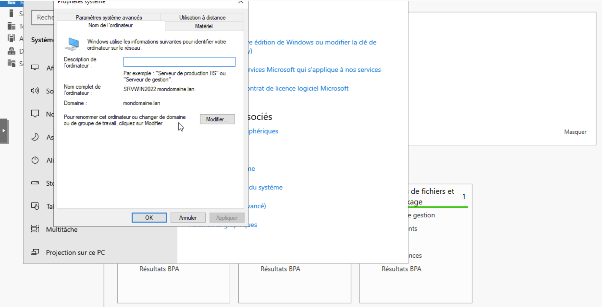

# Ajout d'une IP statique au serveur: 

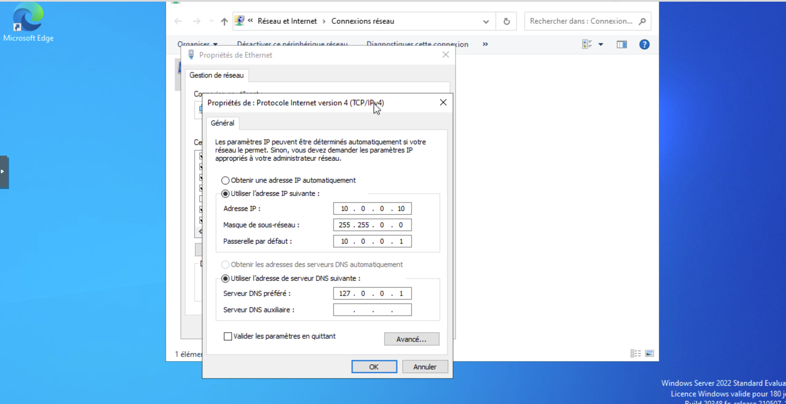

# Ajout du role AD DS:

Dans gérer, ajouter des roles et fonctionnalités, j'ai choisi AD DS, j'ai créé une nouvelle foret que j'ai nommée "mondomaine.lan", ensuite le serveur à redémarré.

# J'ai choisis "promovoir en controleur de domaine", puis j'ai configuré une machine client que j'ai renommée "WIN10CLIENT1:

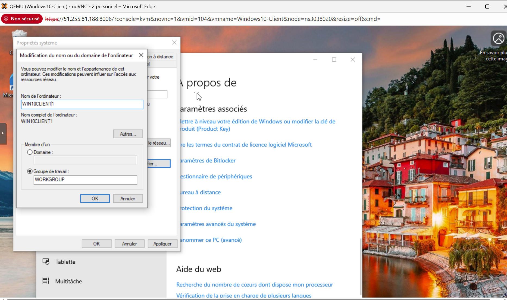

# Configuration du DNS (et adresses IP en DHCP de la machine client), la machine client ping bien le serveur:

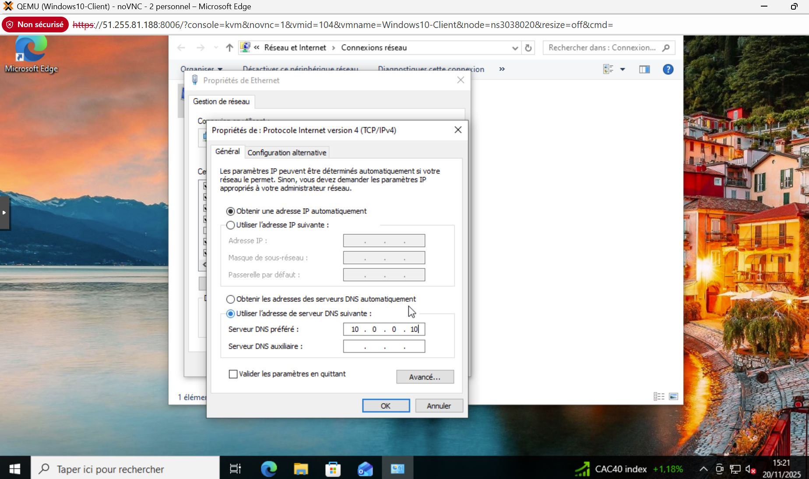
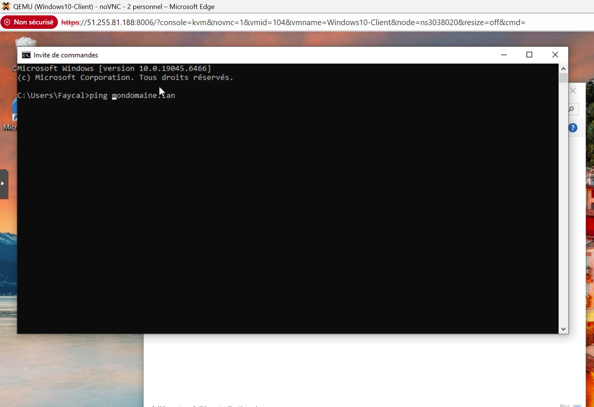

# Ajout de la machine client au domaine "mondomaine.lan":

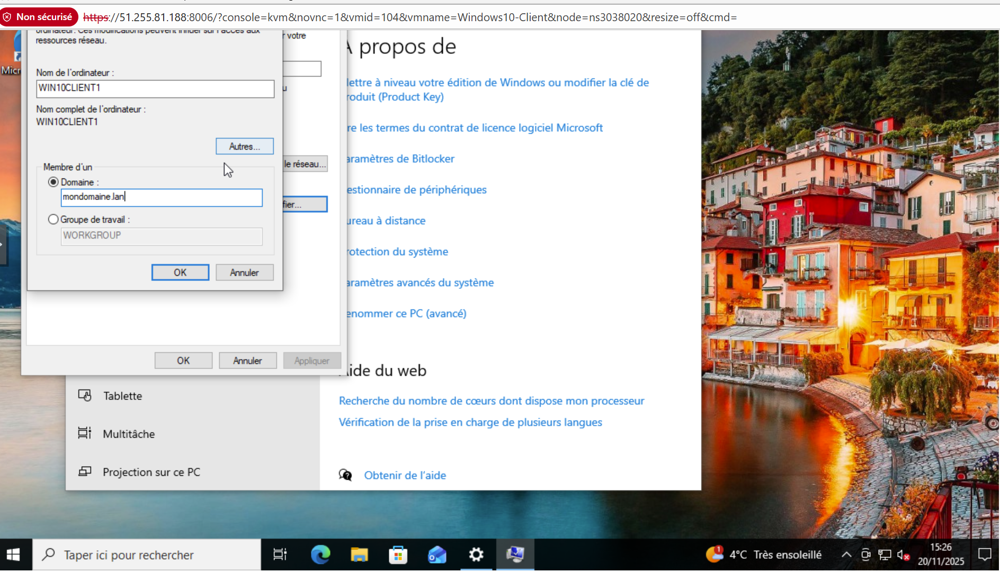
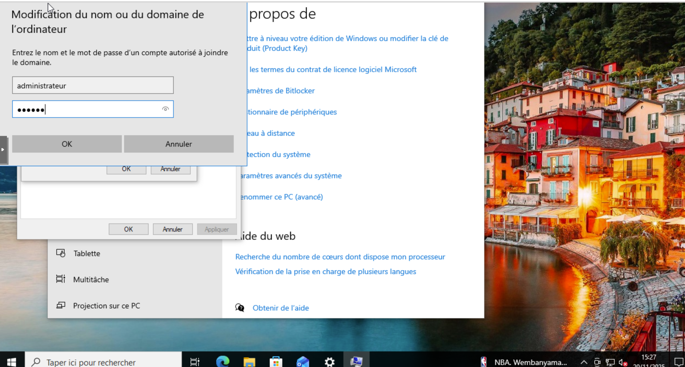
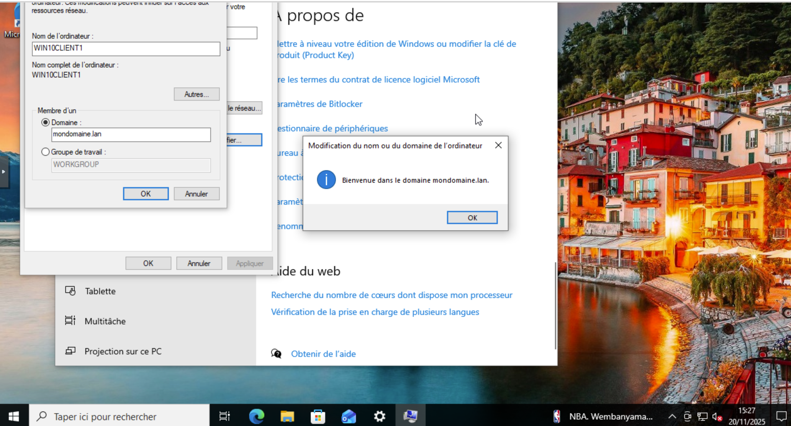

# Ajout d'une unité d'organisation UO_Utilisateurs et création de deux utilisateurs Alice Martin et Bob Dupont:

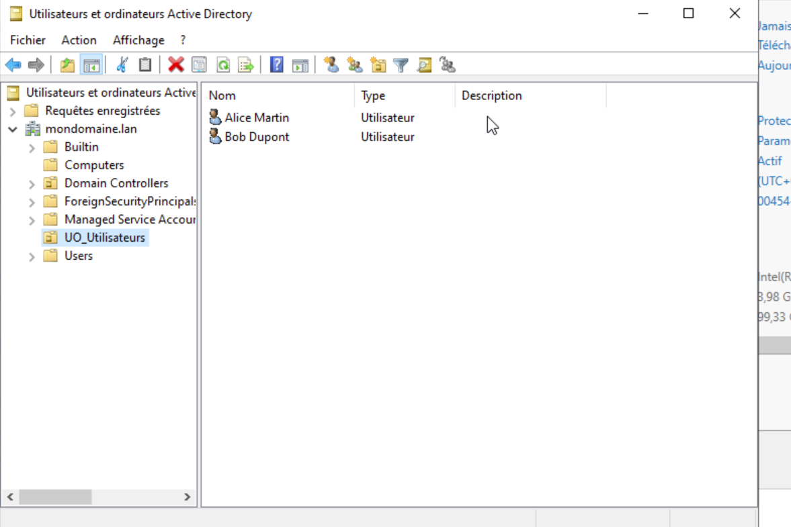

Par mesure de sécurité j'ai activé l'option "changer le mot de passe à la prochaine connexion":

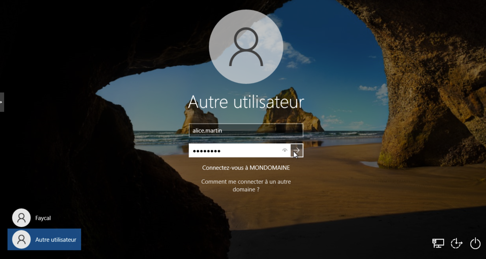
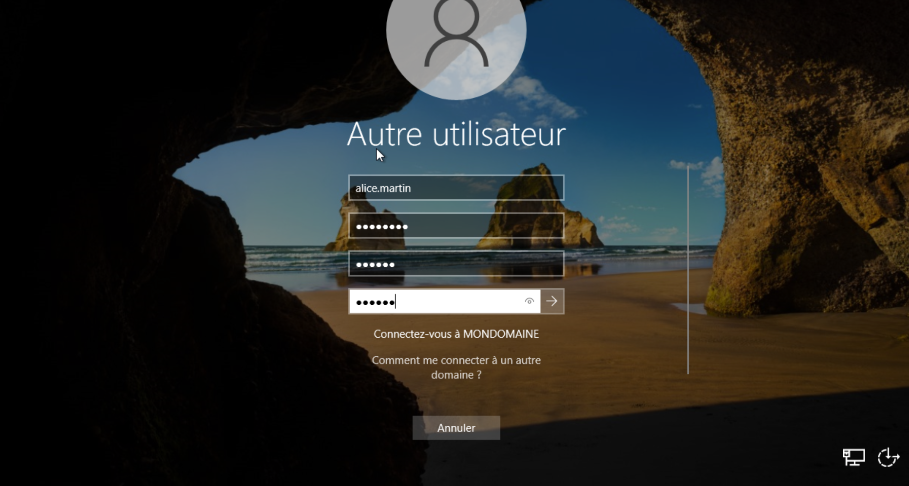

# Les utilisateurs ont bien été ajoutés au domaine, et l'ordinateur client apparait bien dans le dossier Computeurs du controleur de domaine:

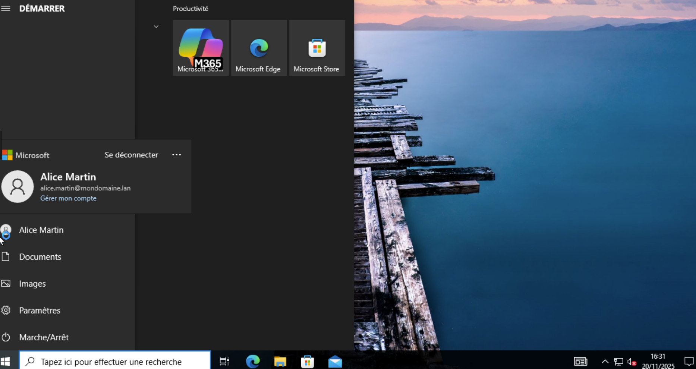
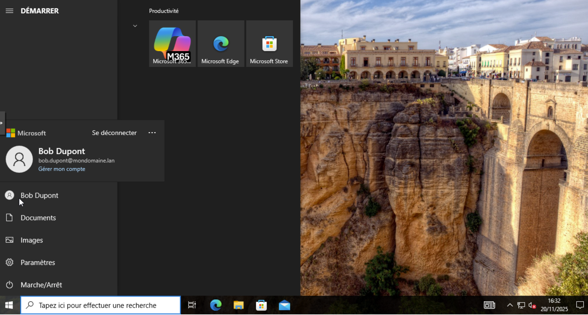
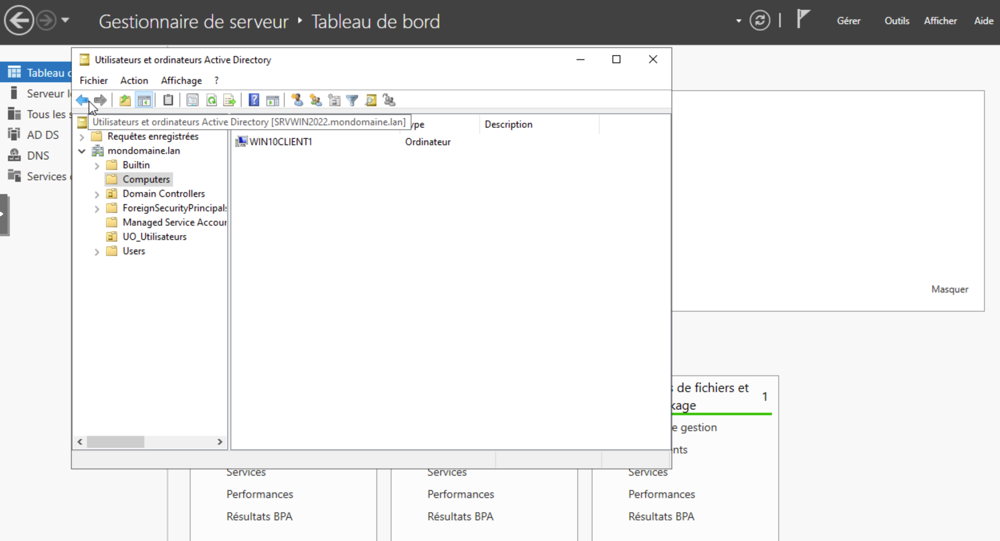

