# Partie 1

## 1.1 - Installation du module (si nécessaire)

Le module AD n'est pas installé, donc on installe les outils d'administration!

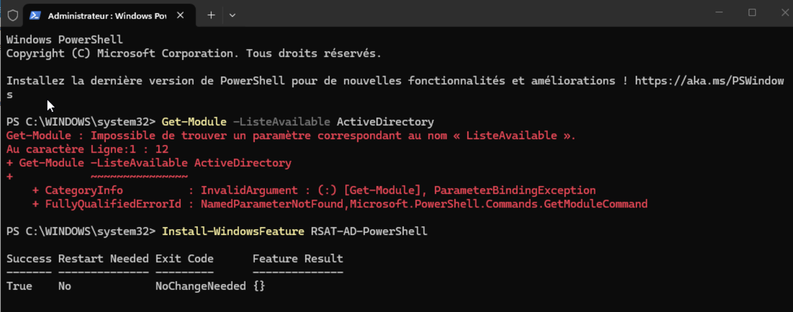

## 1.2 - Exploration du module

Lister les cmdlets disponibles :

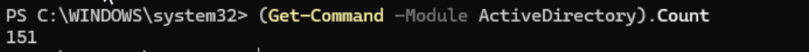

Listez uniquement les cmdlets qui commencent par Get-ADUser :

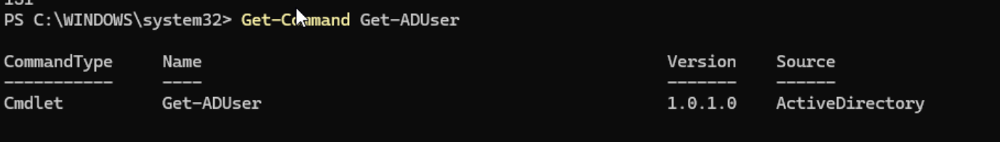

Affichage de l'aide :


## 1.3 - Connexion à l'Active Directory

Test de la connexion à l'AD :

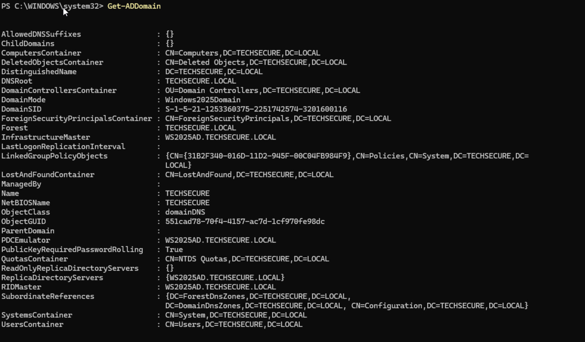

Affichage du nom du domaine, du niveau fonctionnel et des contrôleurs de domaine:

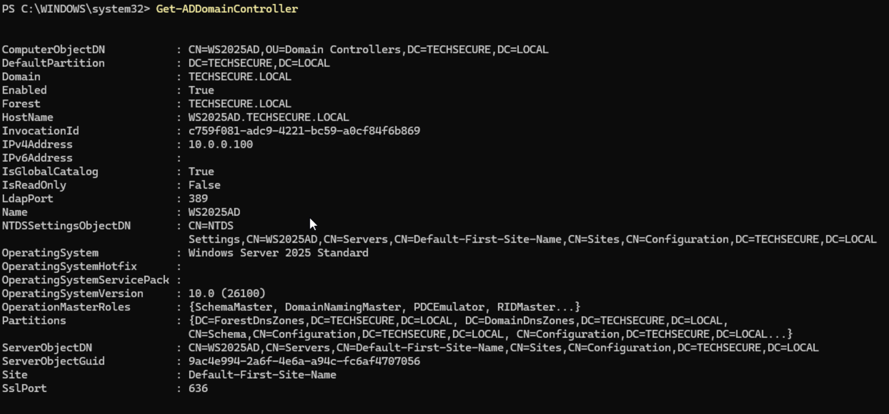

## 1.4 - Premier utilisateur

Affichage de toutes les informations du compte utilisateur :

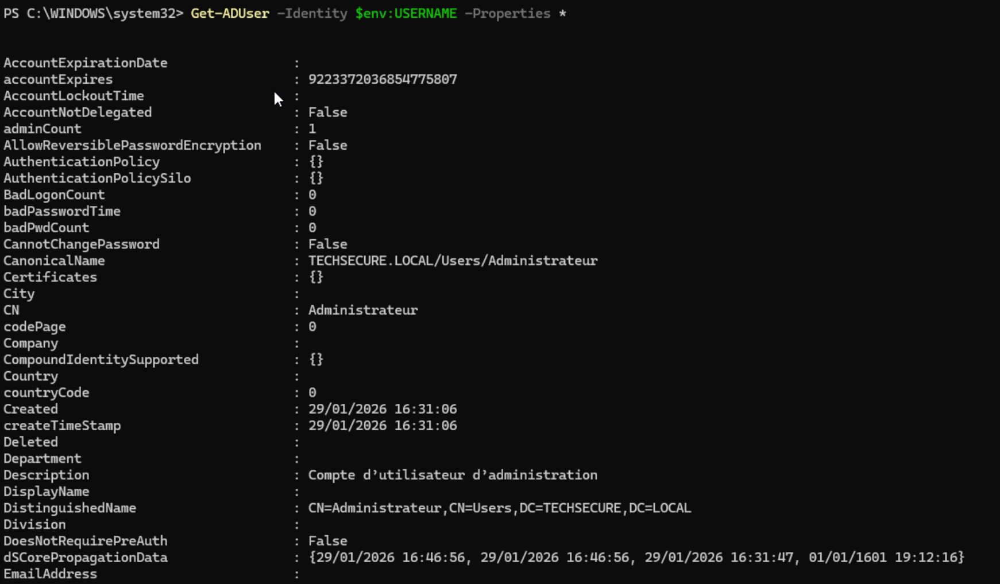

Affichage uniquement du nom, email et titre :

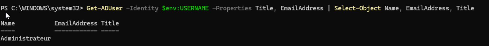

# Partie 2 : Gestion des utilisateurs

## 2.1 - Créer des utilisateurs

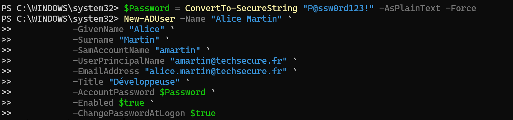

Puis on reproduit les mêmes manipulations pour les utilisateurs Bob et Claire:

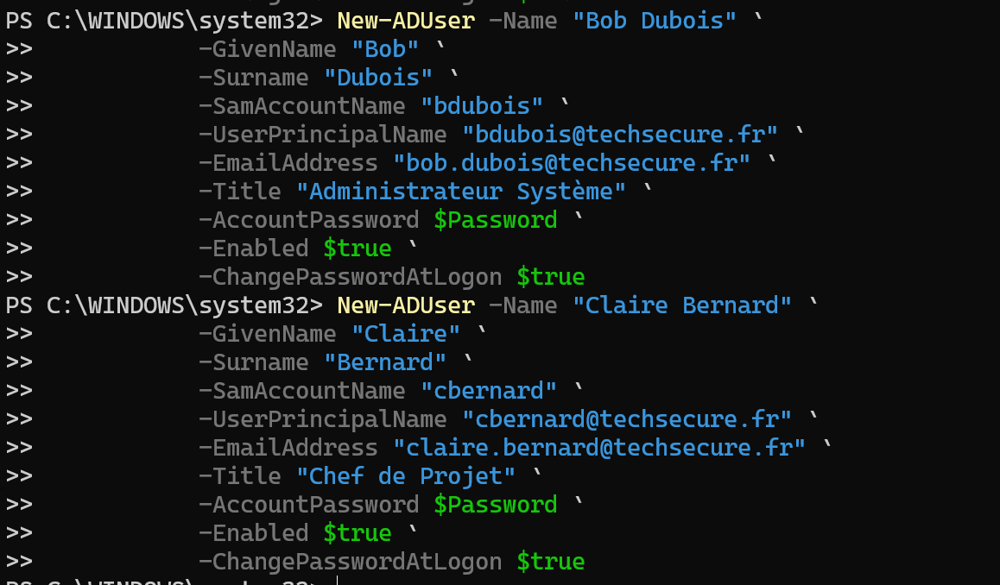

## 2.2 - Rechercher des utilisateurs

Lister tous les utilisateurs du domaine, Alice, Bob et Claire apparaissent bien :

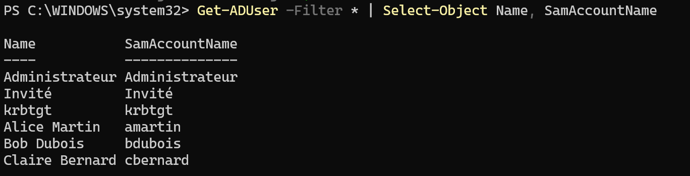

Trouver l'utilisateur dont le login est "amartin":

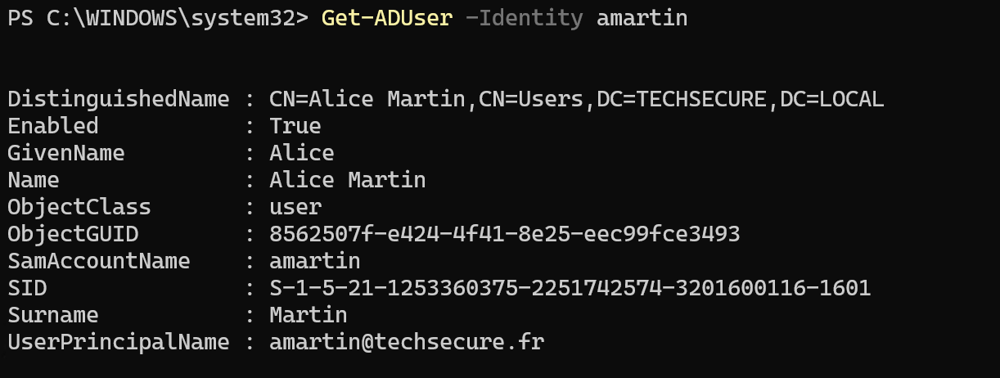

Trouver tous les utilisateurs dont le prénom commence par "B":

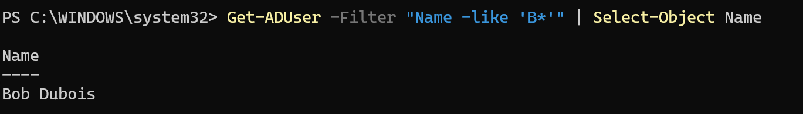

Trouver tous les utilisateurs qui ont "Administrateur" dans leur titre:

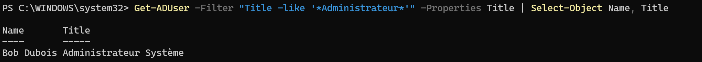

Compter le nombre total d'utilisateurs dans le domaine:


## 2.3 - Modifier des utilisateurs

Pour l'utilisateur "amartin", on change le numéro de téléphone, on ajoute une description et on change le titre via la commande Set-ADUser :

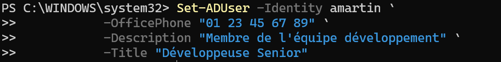

Les modifications ont bien été prises en compte:

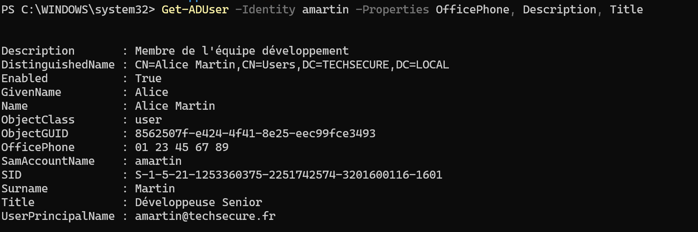

## 2.4 - Désactiver et supprimer

Désactivation du compte "bdubois" :


Le compte est bien désactivé :

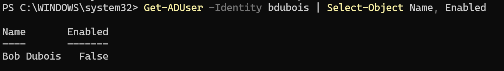

Suppression du compte "cbernard" :

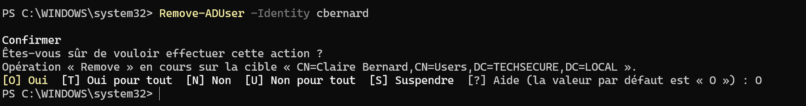

# Partie 3 : Gestion des groupes

## 3.1 - Créer des groupes

Création des groupes de sécurité :

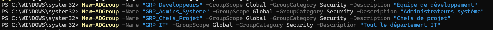

## 3.2 - Ajouter des membres

Ajout de "amartin" dans le groupe "GRP_Developpeurs":

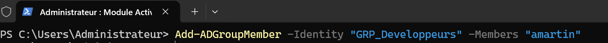

Ajout de "bdubois" dans le groupe "GRP_Admins_Systeme":


Ajout de tous les membres des trois premiers groupes dans "GRP_IT":


# 3.3 - Lister les appartenances

Affichage de tous les membres du groupe "GRP_IT":

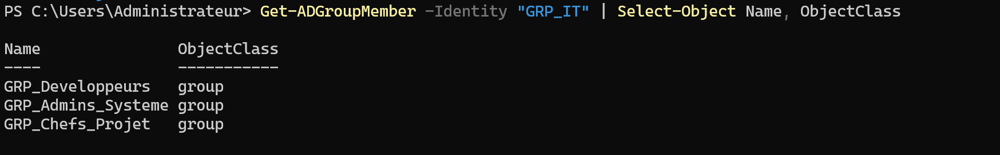

Affichage de tous les groupes dont "amartin" est membre:

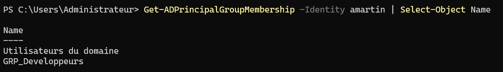

Compter combien de membres a chaque groupe:

GRP_Developpeurs:


GRP_Admins_Systeme: 

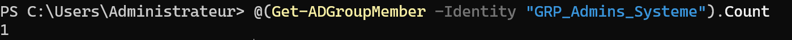

GRP_Chefs_Projet, on constate que Claire Bernard n'est plus dans le groupe car cet utilisateur a été supprimé:


GRP_IT:


## 3.4 - Retirer des membres

On retire "amartin" du groupe "GRP_IT":

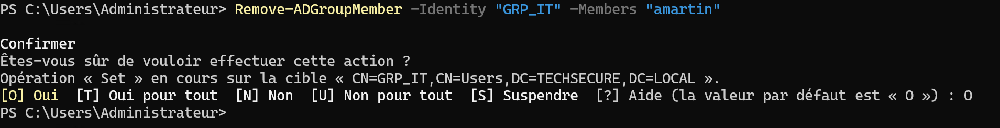

Elle n'est plus membre du groupe :

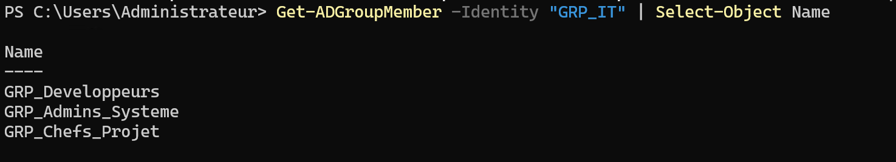

## 3.5 - Groupes imbriqués

Création du groupe "GRP_Tous_Utilisateurs":

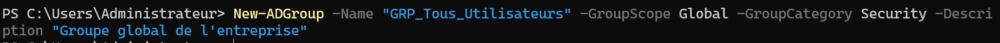

On ajoute les groupes "GRP_IT":


Liste des membres (directs et récursifs) de "GRP_Tous_Utilisateurs":

Membres directs:

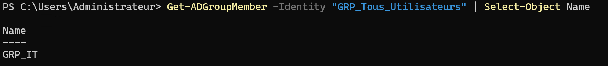

Membres récursifs:

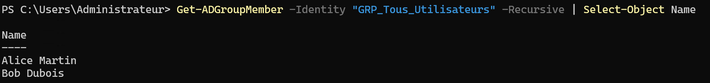


# Partie 4 : Organisation avec les Unités Organisationnelles (OU)

## 4.1 - Créer une structure d'où

- On créer l'OU à la racine:


- Création des sous dossiers Utilisateurs, Groupes, et Ordinateurs:

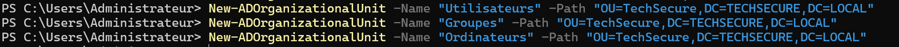

Création des sous dossiers Informatique, RH, et Commercial dans Utilisateurs:

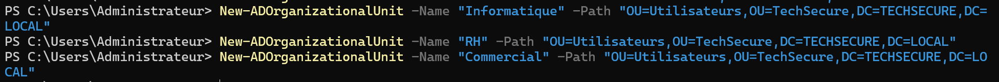

Création des sous dossier Développement et Infrastructure dans Informatique.

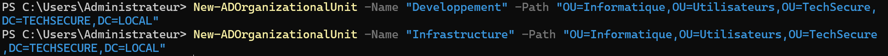

Les groupes ont bien été crées : 

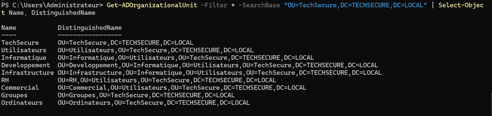

## 4.2 - Déplacer des objets

On déplace l'utilisateur "amartin" dans l'OU "TechSecure/Utilisateurs/Informatique/Developpement" et on déplace tous vos groupes créés précédemment dans l'OU "TechSecure/Groupes" :

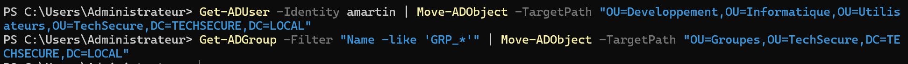

Liste de tous les utilisateurs présents dans l'OU "Informatique" (incluant les sous-OU), on constate que l'utilisateur Alice est bien présent:

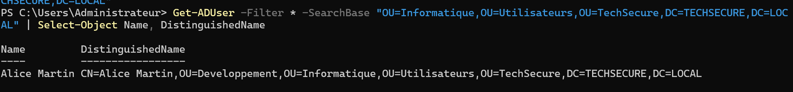

# 4.3 - Recherche par OU

Nombre d'utilisateurs dans l'OU "Informatique" uniquement:

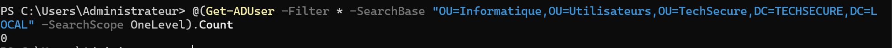

On constate qu'il n'y a aucun utilisateur dans le dossier informatique, car Alice a été déplacée précédemment dans le groupe Développement.

Nombre d'utilisateurs dans l'OU "Informatique" en incluant tous les sous-niveaux et donc celui d'en dessous (Développement ou se trouve désormais Alice). On utilise Substree mais c'est optionnel :

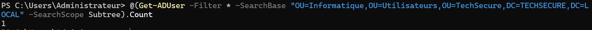

# Partie 5 : Import en masse depuis CSV

## 5.1 - Préparer le fichier CSV

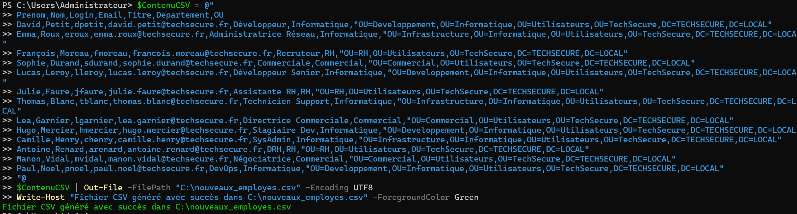

Le fichier .csv est bien crée :

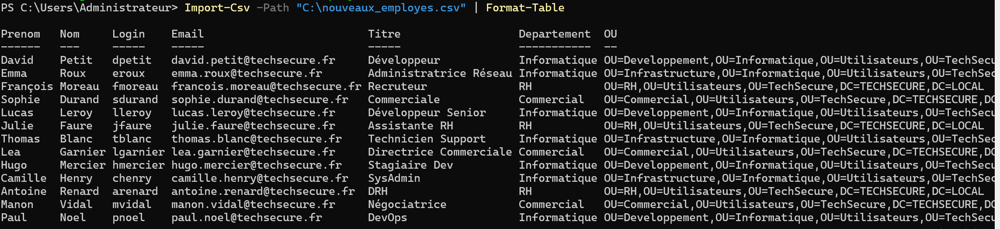

## 5.2 - Script d'import basique

Création du script :

Le script a bien été executé et les utilisateurs crées :


## 5.3 - Améliorer le script avec gestion d'erreurs

On ajoute au script la vérification que le login existe déjà et on exporte les détails des erreurs vers un fichier de Log:

- Dans la partie variable on ajoute le chemin du fichier de Log : ```$FichierLog = "C:\erreurs_import.txt"```

- On ajoute une condition pour que le fichier de Log soit vide au lancement du script en le supprimant s'il existe: ```if (Test-Path $FichierLog) { Remove-Item $FichierLog }```

- On crée une variable pour vérifier que l'utilisateur existe déjà : ```$ExisteDeja = Get-ADUser -Filter "SamAccountName -eq '$Login'" -ErrorAction SilentlyContinue```

- On ajoute la condition au script pour afficher un message pour dire que l'on ignore cet utilisateur :  ```if ($ExisteDeja) {
        Write-Host "[EXISTE DÉJÀ] $NomComplet ($Login) est ignoré." -ForegroundColor Yellow
    }```

- On crée le message d'erreur et on l'ajoute au fichier de Log : ```Write-Host $MessageErreur -ForegroundColor Red
	$MessageErreur | Out-File -FilePath $FichierLog -Append```

	
# 5.4 - Ajouter les groupes lors de l'import

Mise a jour du fichier CSV pour ajouter la colonne Goupes :

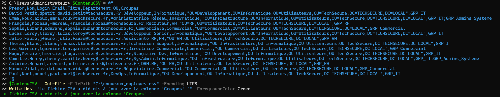

Pour ajouter automatiquement les utilisateurs dans les groupes spécifiés on recupère d'abord les groupes et on les sépare avec un point virgule: ```$LesGroupes = $Utilisateur.Groupes -split ";"```

On boucle sur les groupes trouvés : ```foreach ($Groupe in $LesGroupes) {
        if ($Groupe -ne "") {
            Add-ADGroupMember -Identity $Groupe -Members $Login -ErrorAction SilentlyContinue
        }
    }```


# Partie 6 : Scripts d'automatisation

On ajoute les paramètres :

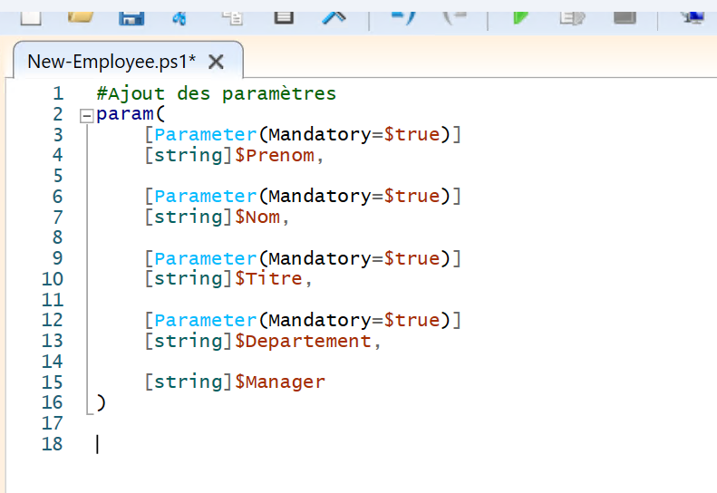

On crée le LOGIN:

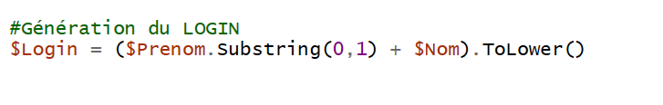

On crée l'email:

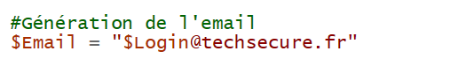

On crée l'utilisateur dans la bonne OU selon le département:

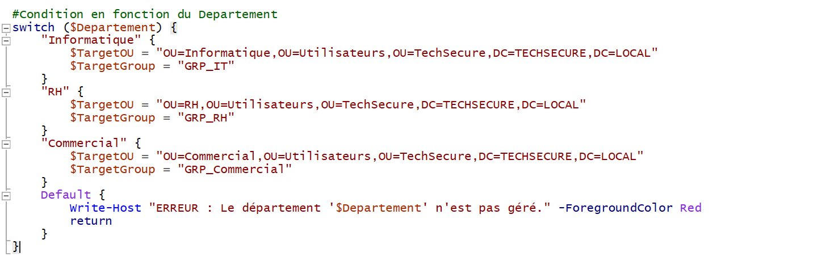

On génère un mot de passe aléatoire sécurisé:

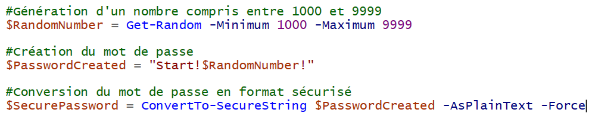

On créer l'utilisateur puis on l'ajoute au groupe selon le département:

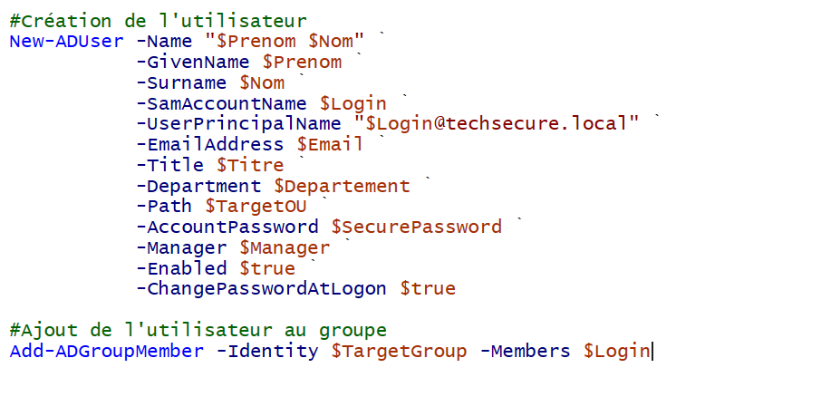

On simule un envoi d'email de bienvenue:

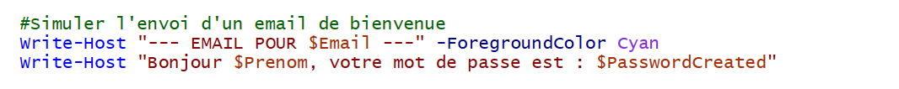

Logger toutes les opérations:

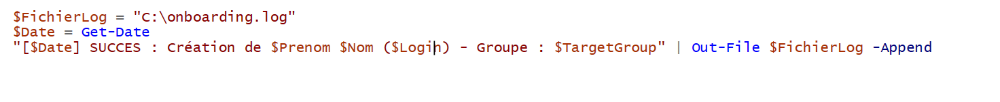

## 6.2 - Script d'offboarding

Création de l'OU "Comptes Désactivés" via l'interface graphique:

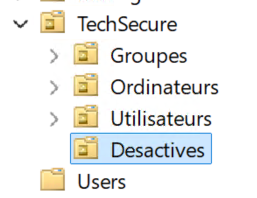

Ajout du paramètre login de l'utilisateur et ajout des variables de destination:

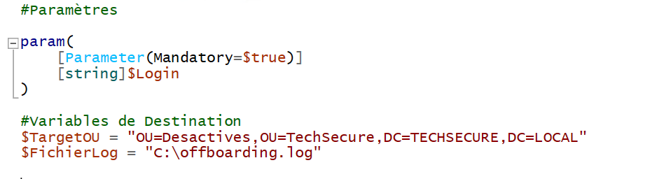

On demande confirmation avant l'exécution du script:

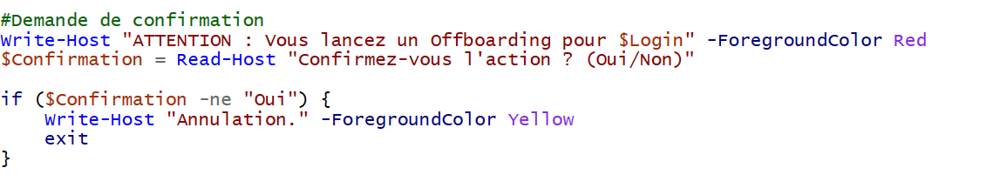

On désactive le compte et on retire les utilisateurs de tous les groupes:

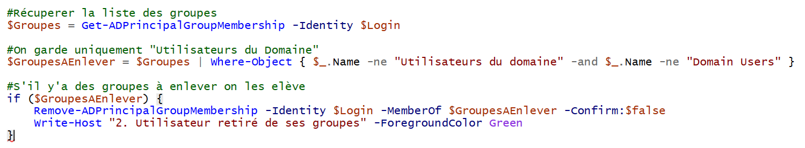

On déplace l'utilisateur ver le groupe "Desactives":


On réinitialise le mot de passe:


Ajout d'une note dans la description avec la date de désactivation:


Logger toutes les opérations:


Le script a bien fonctionné pour l'utilisateur Léa Garnier:


# 6.3 - Script de modification de mot de passe

Ajout des paramètres, du fichier de log, et demande du mot de passe:


On applique le mot de passe, on déverrouille le compte et on force le changement:


Le script fonctionne bien :


