# Atelier LAMP-GLPI
# Consignes 🗒️ :

## Dans cet atelier, vous allez découvrir comment installer et configurer les différents logiciels nécessaire à la mise en place d'une stack LAMP.

LAMP pour Linux, Apache, MySQL et PHP : ce sont les briques de bases nécessaires pour un serveur web hébergeant des applications web codées en PHP !

## Étape 1 : VM Debian
Créez une nouvelle VM sur Virtual Box, avec les réglages suivants :

ISO : Debian 12.8.0 Net Install (disponible sur le drive)
désactivez l'installation automatique (il faut cocher la case Skip unattended installation)
2048 MB de RAM
1 CPU
laissez la case Enable EFI décochée
10 Gio de disque dur
Démarrez la VM et installez Debian !

Lors de l'installation, rien de particulier, à une exception : cochez la case serveur SSH et décochez la case environnement de bureau Debian et GNOME !

### Note :
On a pas besoin d'un environnement de bureau : il n'y a pas d'écran connecté à un serveur ! On s'y connecte en général avec le protocole SSH.

## Étape 2 : sudo
Par défaut, la commande sudo n'est pas installée sur Debian.

Pour éviter de lancer toutes les commandes avec le compte super-utilisateur, on va donc l'installer et mettre notre utilisateur créé pendant l'installation dans le groupe sudo ! Lancez les commandes suivantes :

su -
apt update
apt install sudo
usermod -aG sudo <nom_utilisateur>
⚠️ Remplacez <nom_utilisateur> par le nom de votre utilisateur !

Vous devez ensuite vous déconnecter de l'utilisateur root et également de votre utilisateur. Pour cela, lancez deux fois la commande exit, puis reconnectez-vous.

Essayez de lancer une commande avec sudo pour vérifier que cette étape est OK, par exemple :

sudo nano /etc/network/interfaces
Étape 3 : Guest Additions
Installons les Guest Additions de Virtual Box (ça ne servira à rien en vrai, mais ça fait une étape en plus 😈). Commencez par insérer l'image ISO :

Enfin, lancez les commandes suivantes :

sudo apt update
sudo apt install build-essential dkms linux-headers-$(uname -r)
sudo mount /dev/cdrom /mnt
cd /mnt
sudo ./VBoxLinuxAdditions.run
Redémarrez ensuite la VM avec la commande sudo reboot, puis vérifiez que la module du noyau est chargé avec la commande :

lsmod | grep vbox

## Étape 4 : Apache
Apache est l'un des serveurs (logiciel) web les plus populaires, il est utilisé sur un très grand nombre de serveurs pour héberger des sites web.

Pour l'installer, lancez la commande :

sudo apt install apache2
Pour vérifier qu'Apache est bien installé, passez la carte réseau de votre VM en mode Accès par pont (et sélectionnez votre carte réseau dans la liste déroulante Name) :

Pour que notre Debian récupère une nouvelle adresse IP grâce au serveur DHCP de votre box, lancez la commande suivante :

sudo systemctl restart networking
Récupérez l'adresse IP attribuée avec la commande ip a, puis rendez-vous sur cette adresse IP depuis le navigateur web de votre machine hôte. Vous devriez arriver sur cette page :

Lancez également la commande systemctl status apache2 pour vérifier que le service est bien en cours d'exécution et bien activé au démarrage (enabled) :

💡 Appuyez sur la touche q pour quitter la commande systemctl status, si nécessaire.

## Étape 5 : MariaDB
On a également besoin d'un serveur de bases de données (on appelle cela un SGBDR, pour Système de Gestion de Bases de Données Relationnelles). L'un des plus connus est MySQL, et un fork a vu le jour il y a quelques années : MariaDB.

Pour installer MariaDB, lancez la commande suivante :

sudo apt install mariadb-server
Pour effectuer la configuration initiale de MariaDB, lancez la commande :

sudo mysql_secure_installation
On va vous demander le mot de passe de l'utilisateur root, appuyez simplement sur la touche Entrée de votre clavier.

Enter current password for root (enter for none): 
Cet utilitaire va ensuite vous poser différentes questions, auxquelles il faudra répondre oui (Y) à chaque fois. Ces réglages permettent de sécuriser notre serveur de base de données (et le rendre compatible avec une utilisation en production).

💡 En production, choisissez un mot de passe solide pour l'utilisateur root.

Switch to unix_socket authentication [Y/n] Y
Change the root password? [Y/n] Y
New password:
Re-enter new password:
Password updated successfully!
Remove anonymous users? [Y/n] Y
Disallow root login remotely? [Y/n] Y
Remove test database and access to it? [Y/n] Y
Reload privilege tables now? [Y/n] Y
Connectez-vous ensuite au serveur de base de données avec la commande suivante (saisissez le mot de passe choisi à l'étape précédente quand il vous sera demandé) :

mysql -u root -p
Note

Vous êtes maintenant connectés à un shell MySQL, les commandes à taper sont ... des instructions SQL (un langage utilisé pour gérer les bases de données relationnelles) !

Créez un utilisateur (pour éviter de se connecter avec root, même principe que sur un OS) avec les instructions SQL suivantes :

CREATE USER 'dbuser'@'localhost' IDENTIFIED BY 'rocknroll';
GRANT ALL PRIVILEGES ON *.* TO 'dbuser'@'localhost' WITH GRANT OPTION;
FLUSH PRIVILEGES;
exit
Important

En production, utilisez un mot de passe plus solide que rocknroll !

Vérifiez que le service MariaDB sera bien lancé automatiquement au démarrage avec la commande systemctl status mariadb (vous devez voir enabled).

💡 Appuyez sur la touche q pour quitter la commande systemctl status, si nécessaire.

## Étape 6 : PHP
La plupart des applications web sont développées avec le langage PHP : c'est le cas de GLPI, il faut donc qu'on installe l'interpréteur PHP ! Pour cela, lancez les commandes suivantes :

sudo apt install php libapache2-mod-php
On va également installer plusieurs modules de PHP, souvent utiles (certains sont indispensables, comme le module php-mysql) :

sudo apt install php-{curl,gd,intl,memcache,xml,zip,mbstring,json,mysql,bz2,ldap}
Une fois l'installation terminée, redémarrez le service Apache avec la commande sudo systemctl restart apache2.

Pour vérifier que PHP est opérationnel, on va créer un fichier très basique en PHP. Lancez la commande suivante :

echo "<?php phpinfo(); ?>" | sudo tee -a /var/www/html/info.php
Note

Le dossier /var/www/html est le dossier exposé/servi par défaut par Apache. On peut y déposer des fichiers HTML ou PHP qui seront servis à nos visiteurs par le serveur Apache.

Depuis le navigateur sur votre machine hôte, rendez-vous à l'adresse http://192.168.1.X/info.php.

⚠️ Remplacez X par le dernier octet de l'adresse IP de votre VM Debian.

💡 Ce fichier permet d'avoir des informations techniques (version de l'interpréteur, modules installés, etc.) sur notre installation de PHP !

## Étape 7 : Connexion SSH
Marre de faire des fautes de frappes en recopiant les commandes ? Connectons-nous en SSH à la VM pour résoudre ce problème !

Depuis votre machine hôte, téléchargez et installez Putty. Une fois installé, lancez le logiciel et saisissez l'adresse IP de votre VM Debian.

Cliquez sur le bouton Open, puis acceptez la connexion à la machine.

Puis saisissez votre nom d'utilisateur et votre mot de passe pour établir la connexion SSH.

Vous pourrez maintenant copier/coller les commandes (faites un clic droit pour coller avec Putty) !

### Tip:
Si votre machine hôte tourne sur un système GNU/Linux ou MacOS, vous pouvez simplement ouvrir un terminal et taper la commande ssh <nom_utilisateur>@192.168.1.<IP>, pas besoin d'installer Putty !

## Étape 8 : GLPI
Téléchargez GLPI avec l'utilitaire wget (qui permet de télécharger des fichiers depuis Internet) en lançant la commande suivante :

cd ~
wget https://github.com/glpi-project/glpi/releases/download/10.0.17/glpi-10.0.17.tgz
Vérifiez avec ls que l'archive a bien été téléchargée, puis décompressez-la dans le dossier /var/www/html avec la commande :

sudo tar -xvf glpi-10.0.17.tgz -C /var/www/html
Vérifiez que l'archive a bien été décompressée au bon endroit avec la commande ls /var/www/html (vous devriez voir un dossier glpi) puis essayez d'accéder à l'adresse http://192.168.1.X/glpi depuis votre navigateur web. 

Sélectionnez la langue, puis suivez l'installation jusqu'à arriver sur l'erreur suivante.

Cette erreur est due à un problème de permissions dans le dossier /var/www/html ! Pour corriger cela, lancez les commandes suivantes :

sudo chown -R <nom_utilisateur>:www-data /var/www/html
sudo chmod 770 -R /var/www/html
⚠️ Remplacez bien <nom_utilisateur> par le nom de votre utilisateur Debian choisi pendant l'installation du système.

💡 On reviendra sur ces deux commandes pendant la correction.

Vous pouvez ensuite poursuivre l'installation en cliquant sur le bouton Réessayer ! Plus loin dans le processus d'installation, vous devriez obtenir des erreurs de sécurité.

On va ignorer ces erreurs pour l'instant, on corrigera ça plus tard. Cliquez sur le bouton Continuer pour poursuivre l'installation.

Quand on vous demande la configuration de la connexion à la base de données, saisissez localhost comme adresse du serveur, dbuser comme nom d'utilisateur (si vous ne l'avez pas modifié dans les instructions SQL de l'étape 5) et le mot de passe que vous avez choisi (si vous avez recopié les instructions, le mot de passe est rocknroll) :

À l'étape suivante, créez une nouvelle base de données nommée glpi.

💡 Après avoir cliqué sur le bouton Continuer, l'initialisation de la base de données peut prendre plusieurs minutes. Soyez patients !

### Warning:
Ne rechargez pas la page pendant l'initialisation de la base de données, sinon vous devrez recommencer depuis le début de l'installation de GLPI.

Une fois l'initialisation de la base de données terminée, vous arriverez sur cet écran. À l'étape suivante, vous pouvez décocher la case Envoyer "statistiques d'usage" puis cliquer plusieurs fois sur Continuer jusqu'à la fin de l'installation.

Pour votre première connexion, utilisez le nom d'utilisateur glpi et le mot de passe glpi.

Si tout s'est bien passé, vous avez maintenant un GLPI opérationnel 🎉

## Bonus : PHPMyAdmin & Adminer
Pour administrer un serveur de base de données relationnelles tel que MySQL ou MariaDB, on utilise en général une interface web. Il existe deux solutions populaires :

PHPMyAdmin
Adminer
PHPMyAdmin
Pour installer PHPMyAdmin, lancez la commande suivante :

sudo apt install phpmyadmin
Pendant l'installation, on va vous demander de choisir le serveur web à configurer. Sélectionnez apache2 en appuyant sur la touche Espace de votre clavier AVANT d'appuyer sur Entrée pour valider.

Un peu plus tard, on vous demande s'il faut configurer la base de données avec dbconfig-common, vous pouvez répondre Oui.

À l'étape suivante (génération du mot de passe de phpmyadmin), appuyez simplement sur la touche Entrée.

Une fois l'installation terminée, vous devriez pouvoir accéder à PHPMyAdmin depuis votre navigateur web à l'adresse http://192.168.1.X/phpmyadmin (n'oubliez pas de remplacer X par le dernier octet de l'adresse IP de votre VM Debian). Connectez-vous avec l'utilisateur dbuser et le mot de passe choisi lors de la configuration du serveur MariaDB (rocknroll, si vous avez recopié les instructions SQL).

Une fois connecté, vous pourrez parcourir le contenu de la base de données de GLPI.

Adminer
PHPMyAdmin est une très bonne interface pour MySQL/MariaDB, mais il existe une solution plus légère : Adminer !

Pour l'installer, lancez les commandes suivantes :

cd /var/www/html
mkdir adminer
cd adminer
wget https://github.com/vrana/adminer/releases/download/v4.8.1/adminer-4.8.1-mysql.php
mv adminer-4.8.1-mysql.php index.php
Vous devriez ensuite pouvoir accéder à Adminer à l'adresse http://192.168.1.X/adminer. Utilisez le même nom d'utilisateur et mot de passe que sur PHPMyAdmin pour vous connecter :

💡 Adminer offre quasiment les mêmes fonctionnalités que PHPMyAdmin, mais tout son code source est dans un seul fichier PHP.

## Super-bonus : sécurité
Déjà fini ?

Si vous voulez aller plus loin, essayez de résoudre les problèmes de sécurité indiqués lors de l'installation.

Vous devrez lire la documentation officielle pour cela, notamment la section liée à la configuration du serveur Apache, et potentiellement vous renseigner sur les Virtual Hosts Apache.

### Note:

Ce bonus est loin d'être évident : pas de panique si vous bloquez sur cette étape !

Une fois les modifications effectuées sur la configuration d'Apache, rendez-vous sur la page Configuration > Générale pour vérifier que tout est OK.

## Hyper-bonus : configuration de GLPI
Si vous arrivez jusque-là : bravo 🎉💪

S'il n'est pas trop tard, vous pouvez toujours essayer de configurer votre serveur GLPI, créer des tickets, et même potentiellement y ajouter des machines Windows à superviser (vous pouvez y ajouter une autre VM en mode Accès par pont, par exemple) !

---

# Etape 1 : VM Debian

## Création de la VM :

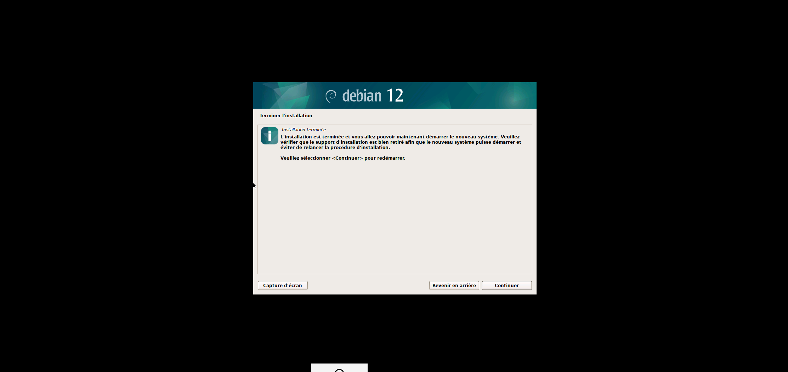

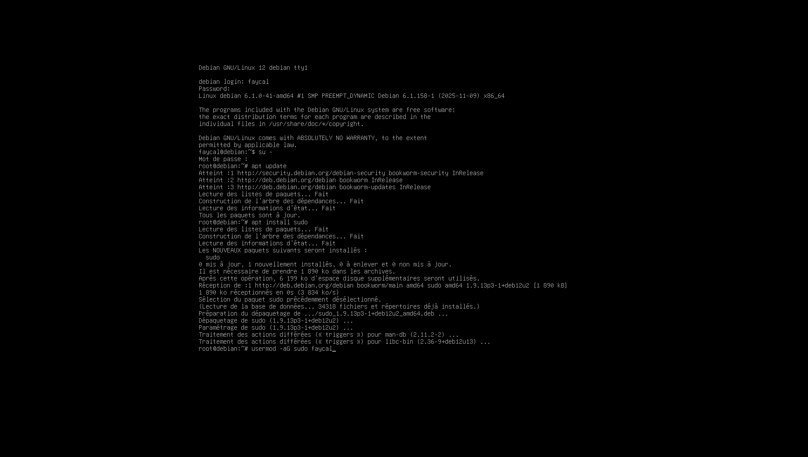

# Étape 2 : sudo

- On lance les commandes :

su -

apt update

apt install sudo

usermod -aG sudo faycal 

- La commande sudo nano /etc/network/interfaces fonctionne bien :

# Étape 3 : Guest Additions

- Nous sommes sur VMWARE, nous allons donc adapter les commmandes :

- On redémarre la VM et on tape la commande lsmod | grev vmw :

# Étape 4 : Apache

- On installe Apache via la commande  sudo apt install apache2 :

- On passe en mode connexion par pont :

- On récupère une nouvelle adresse IP, on affiche l'adresse ip via la commande ip a et on la rentre dans le navigateur ::

- On constate que le service est bien en cours d'exécution :

# Étape 5 : MariaDB

- On lance l'installation de MariaDB :

- On entre dans l'utilitaire et on répond aux questions, on entre dans la base de données et on crée l'utilisateur :

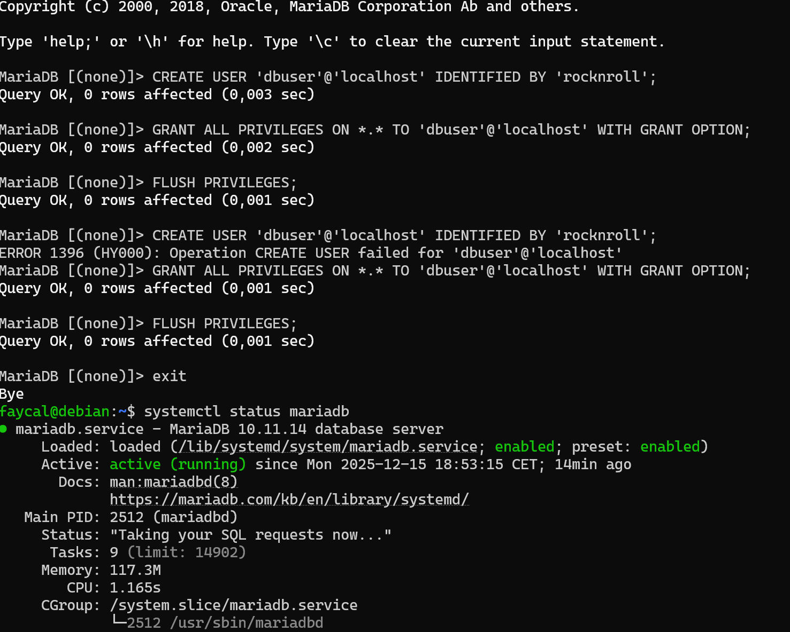

# Étape 6 : PHP

- Installation de PHP :

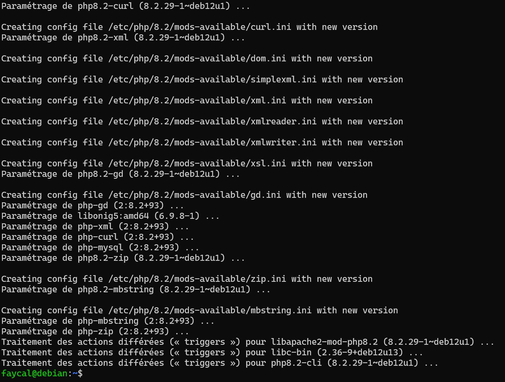

- On récupère notre ip et on contstate que PHP est bien installé :

# Étape 7 : Connexion SSH

- On télécharge et on installe Putty :

# Étape 8 : GLPI

- On télécharge GLPI, et on vérifie qu'il est bien installé :

- On retrouve bien une erreur de permissions :

- Changement des permissions :

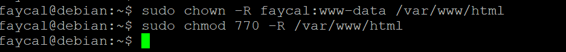

- Configuration de la connexion à la base de données et création de la base de données GLPI :

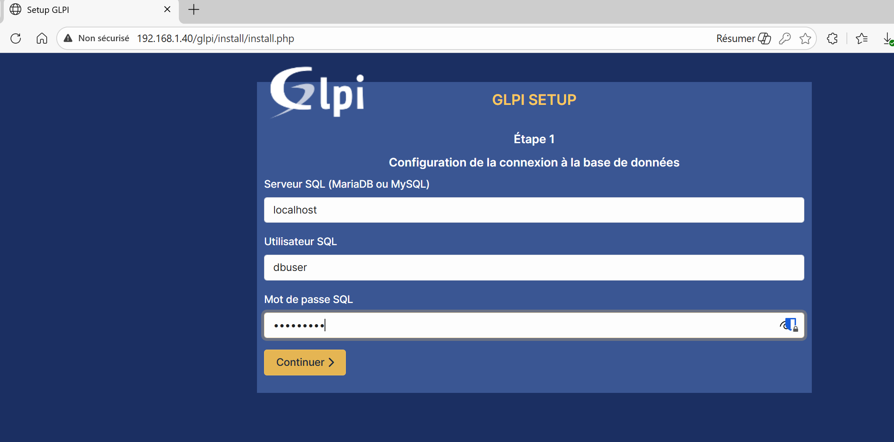

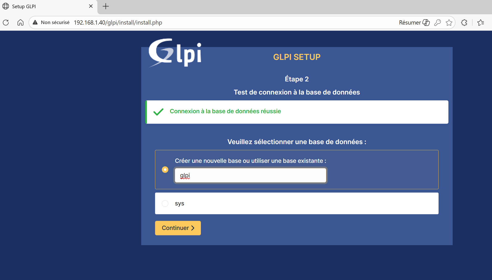

- Le GLPI est opérationnel :

# Bonus : PHPMyAdmin & Adminer

## PHPMyAdmin :

- On tape la commande sudo apt install phpmyadmin
  
- On sélectionne Apache2 comme serveur web à configurer :

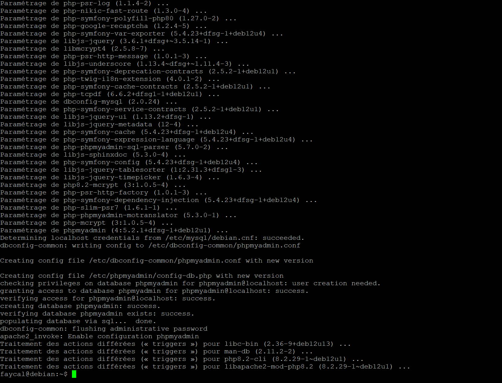

- Connexion à PHPMyAdmin :

## Adminer :

- Installation d'Adminer :

  cd /var/www/html
  
mkdir adminer
cd adminer
wget https://github.com/vrana/adminer/releases/download/v4.8.1/adminer-4.8.1-mysql.php
mv adminer-4.8.1-mysql.php index.php

- On accède à Adminer :

# Super-bonus : sécurité :

- On créer le fichier de configuration :

  sudo nano /etc/apache2/sites-available/glpi.conf

- On active le module URL Rewriting :

  sudo a2enmod rewrite

- On désactive le site par défaut et on active le site GLPI, puis on redémarre:

  sudo a2dissite 000-default.conf

  sudo a2ensite glpi.conf

  sudo systemctl restart apache2

- On constate qu'il ne reste que deux erreurs à traiter :

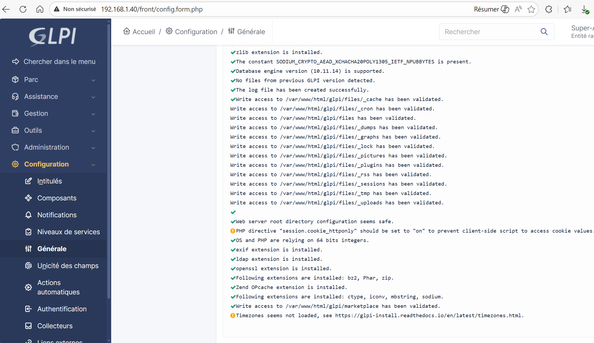

- Activation de sécurité pour les cookies de session, on ouvre le fichier de configuration PHP :

sudo nano /etc/apache2/php.ini

- On passe modifie la ligne session.cookie_httponly :

On passe en on et on redémarre Apache :

- Pour les fuseaux horaires, on rempli la base via cette commande :

 mysql_tzinfo_to_sql /usr/share/zoneinfo | sudo mariadb -u root -p mysql

 sudo mariadb -u root -p

- On lance les commandes SQL:

 GRANT SELECT ON mysql.time_zone_name TO 'dbuser'@'localhost';
 
 FLUSH PRIVILEGES;
 
 exit

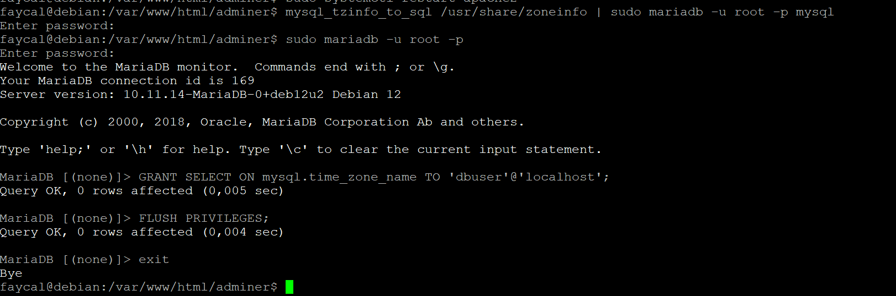

- On constate qu'il n'ya plus d'erreurs :

# Hyper-bonus : configuration de GLPI

## Premiere partie :

- On se connecte en super admin et on change le mot de passe, puis on créer un utilisateur :

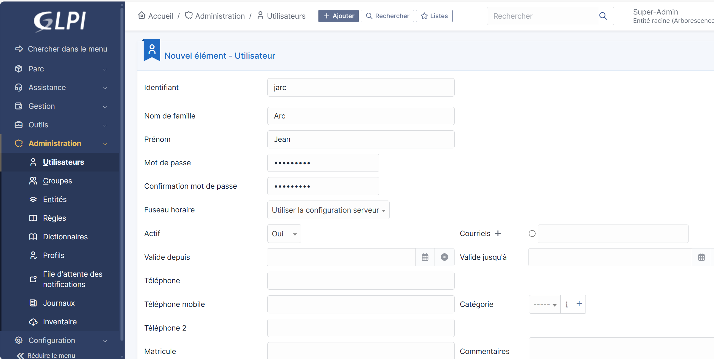  

- On se connecte avec le compte de l'utilisateur Jean Arc et on créer un nouveau ticket :

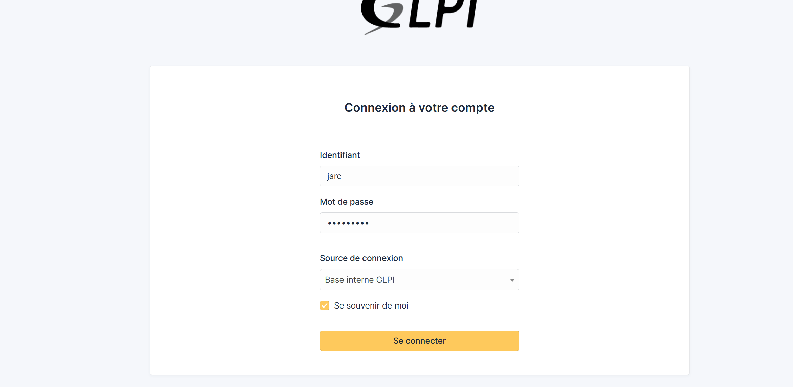

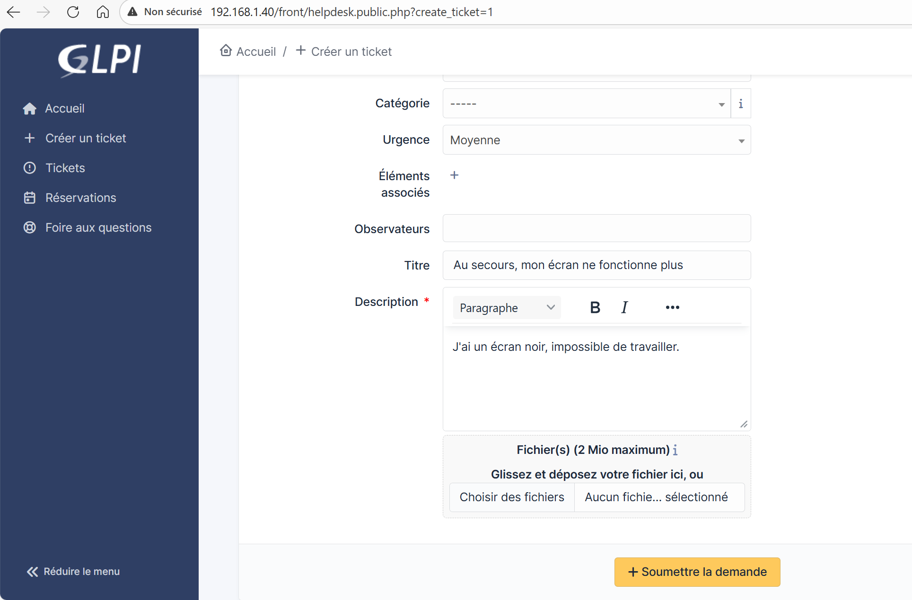

- On constate que le ticket est bien visible, via le compte admin, on peut le marquer comme "résolu" :

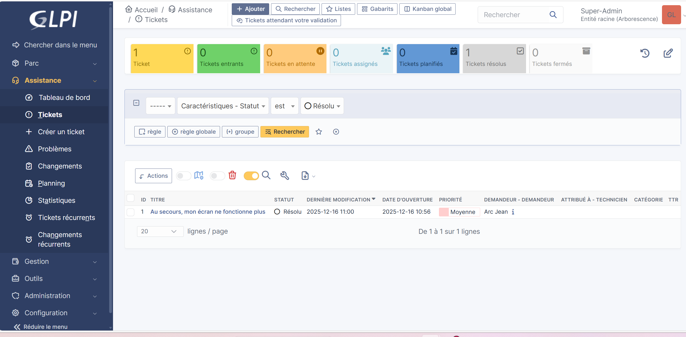

## Deuxième partie :

- On active l'inventaire et on sauvegarde :

- 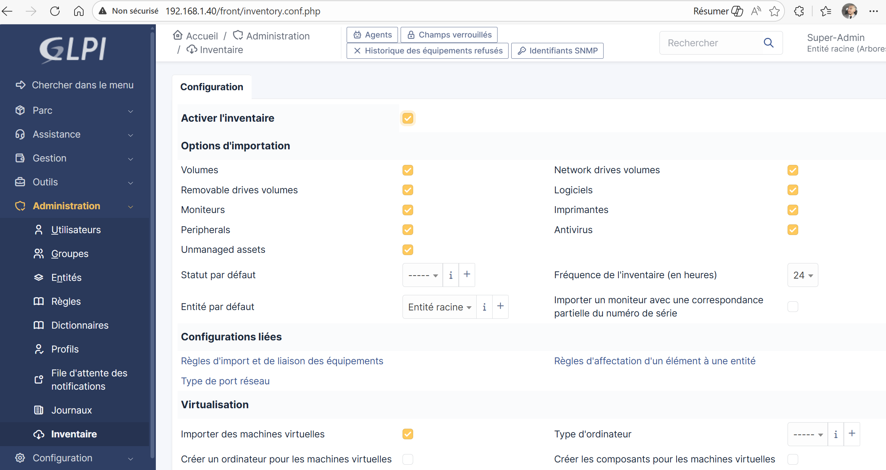
  
- On installe l'agent sur la machine Windows :

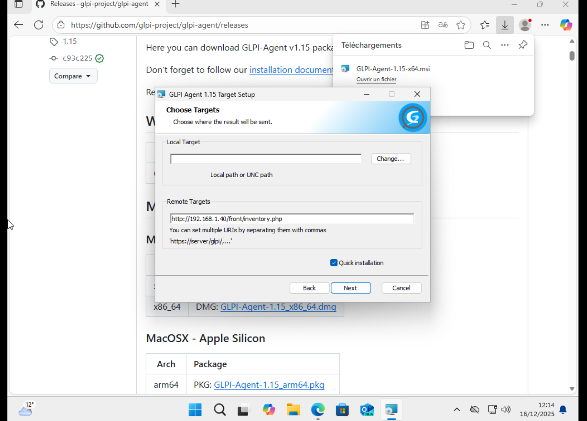

- On accède à l'interface locale de l'agent et on force l'inventaire :

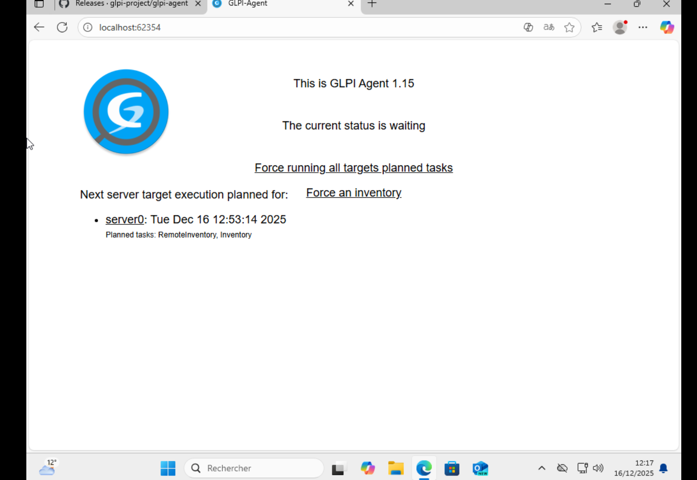

- On constate que la machine Windows apparait bien dans GLPI :

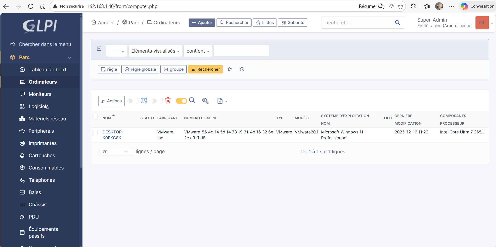

 
  

  

  
