# Portfolio : Automatisation et Administration Linux (Bash)

## Ce dépôt contient l'ensemble des scripts réalisés. L'objectif est d'automatiser des tâches courantes : sauvegarde, monitoring, gestion des utilisateurs et nettoyage.

# Partie 1 : Script de sauvegarde automatisée

## 1.1 - Création du script

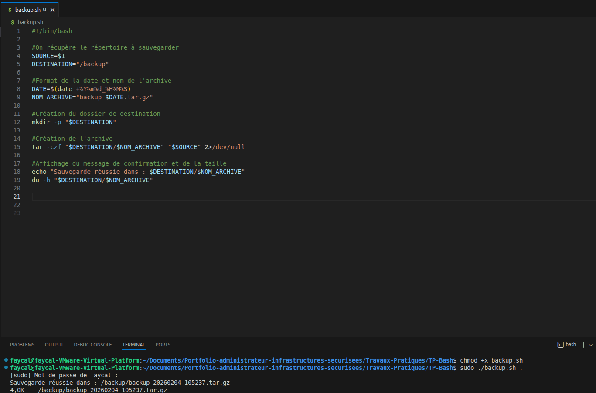

## 1.2 - Amélioration du script

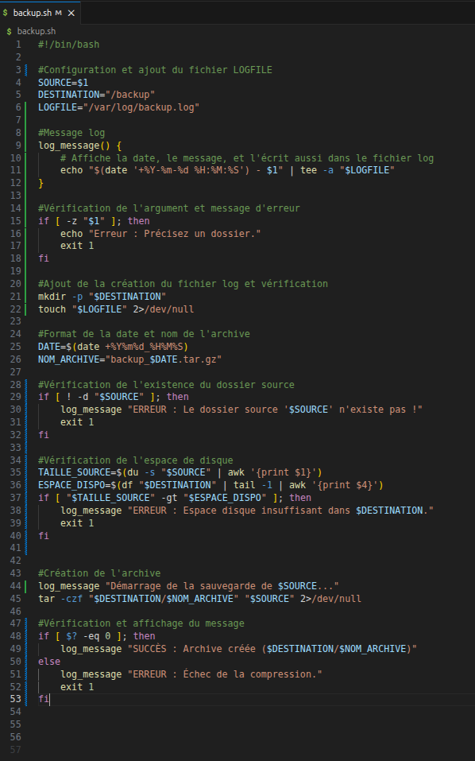

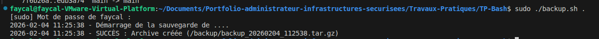

## 1.3 - Ajout d'une rotation des sauvegardes

Ajout du bloc de code pour la rotation des sauvegardes

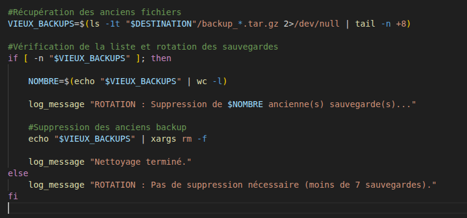


# 1.4 - Test du script avec différents scénarios

- Sauvegarde d'un dossier existant:

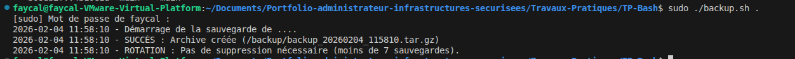

- Tentative de sauvegarde d'un dossier inexistant :

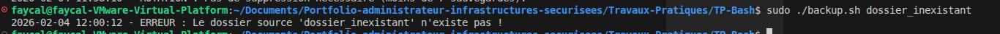

- Exécutions multiples pour vérifier la rotation :

Création de 10 sauvegardes pour essayer:
```sudo touch /backup/backup_test_vieux_{1..10}.tar.gz```

Les fichiers sont bien crées :

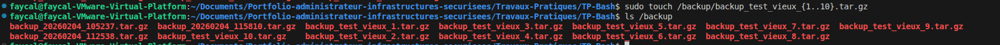

Après le lancement du script nous avons bien le message de confirmation et il ne reste plus que 7 sauvegardes:


# Partie 2 : Moniteur de ressources système

## 2.1 - Création du script Monitor:

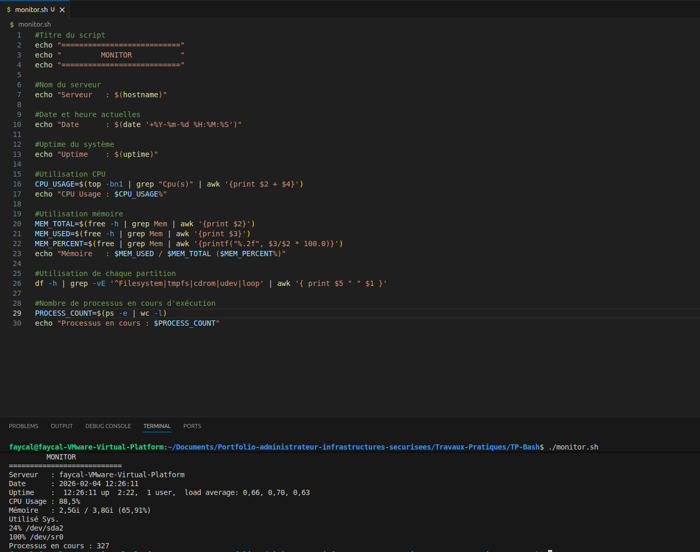

## 2.2 - Ajout d'un système d'alertes colorées :

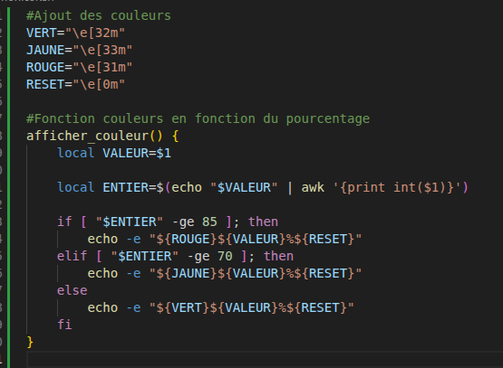

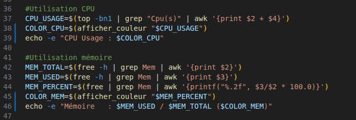

Les couleurs s'affichent bien :

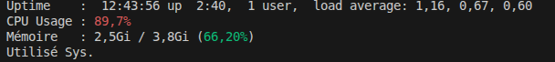

## 2.3 - Création d'une option pour générer un rapport texte :

- Stockage du disque dans une variable pour pouvoir la réutiliser dans le rapport:

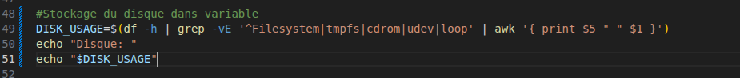

- Création d'un bloc rapport:

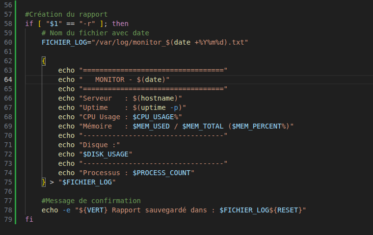

- Le rapport est bien crée apès avoir lancé le script:

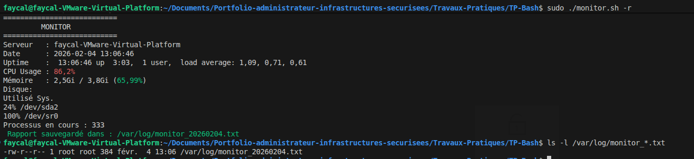


## 2.4 - Ajout de l'affichage des 5 processus consommant le plus de CPU et Mémoire:

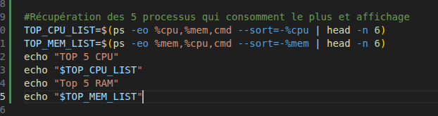

Ajout dans le rapport :

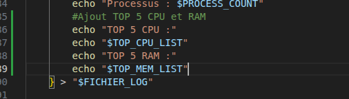


Partie 3 : Gestionnaire d'utilisateurs en masse

## 3.1 - Création du fichier CSV :

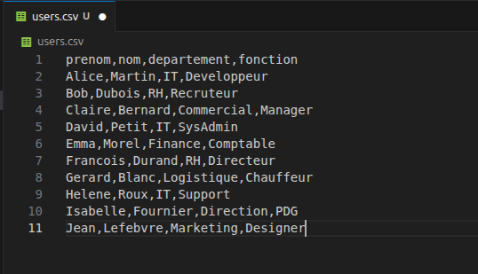

## 3.2 - Création du script:

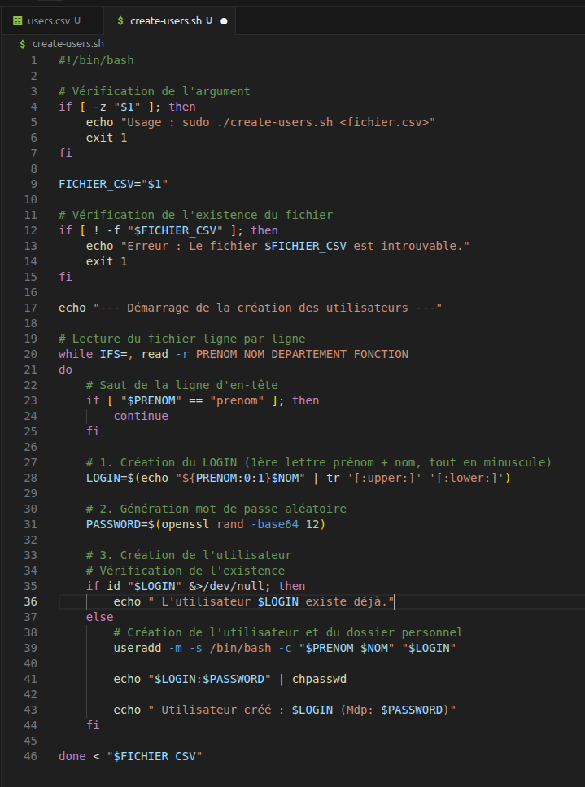

Les comptes utilisateurs sont bien crées au lancement du script :

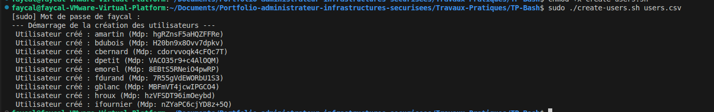

## 3.3 et 3.4 - Amélioration du script et ajout d'une option de suppression

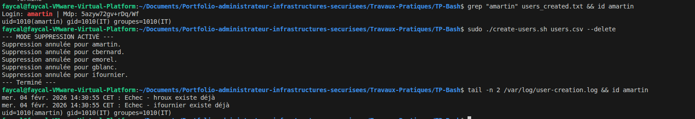


# Partie 4 : Nettoyeur de système automatique

## 4.1 - Création du script

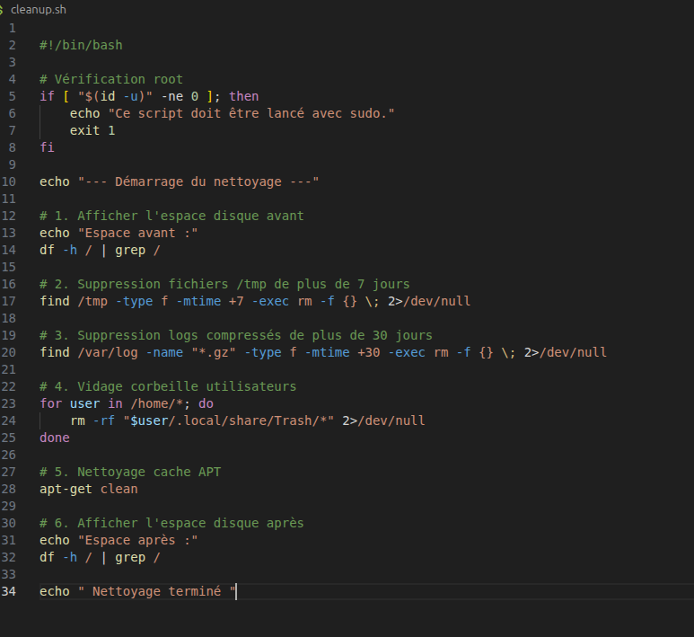

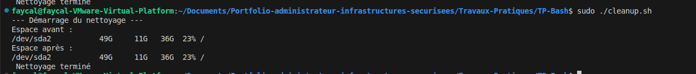

## 4.2 - Ajout d'un mode sécurisé :

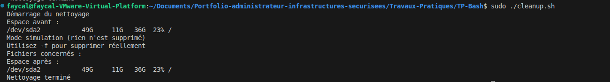

## 4.3 - Amélioration :

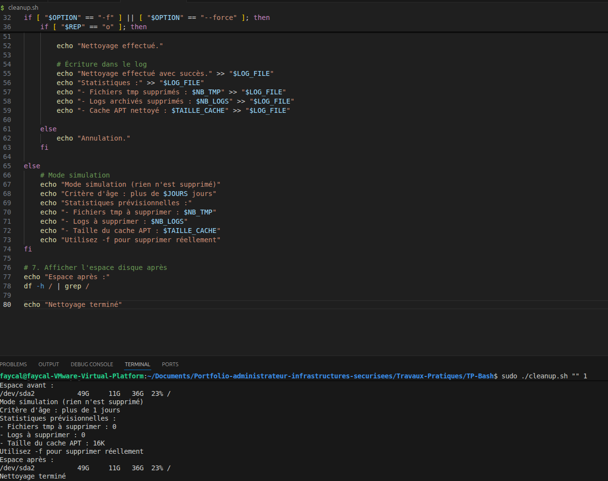

# Partie 5 : Vérificateur de santé des services

## 5.1 - Création d'un fichier de configuration services.conf listant les services à surveiller :

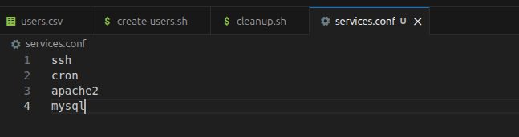

## 5.2 - Création du script :

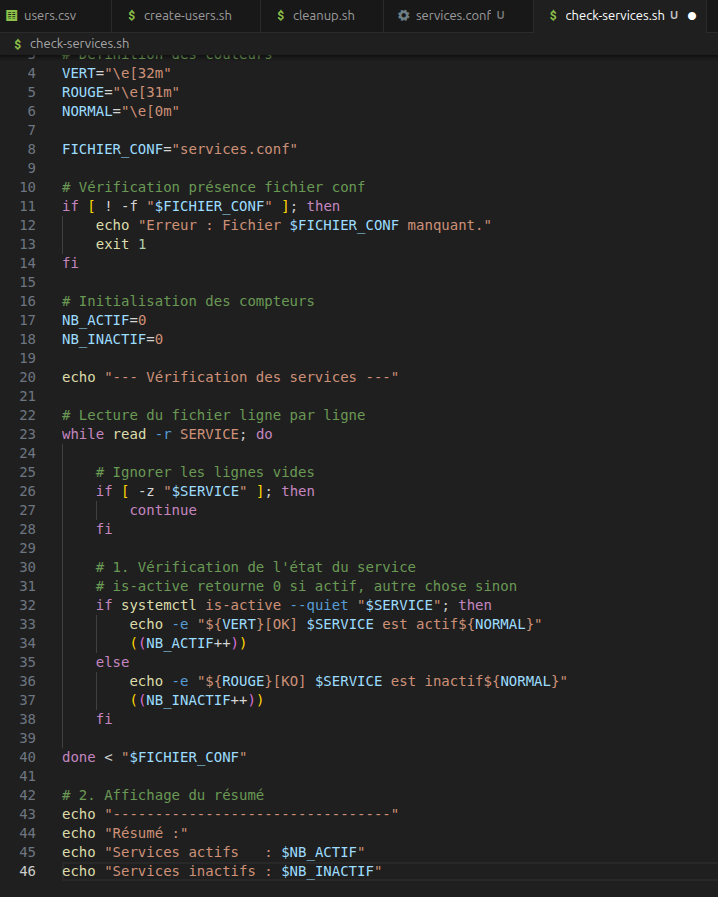

Le script fonctionne :


## 5.3 - Ajout de fonctionnalités avancées :

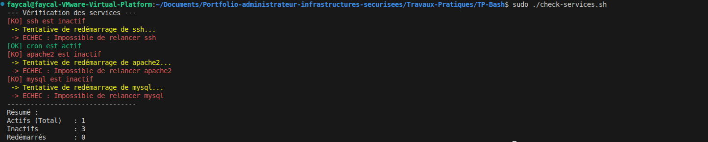

## 5.4 - Création d'un mode monitoring :

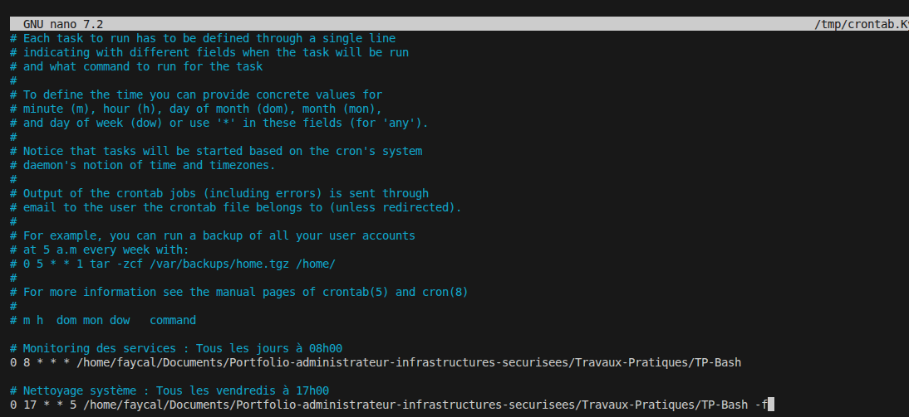

# Partie 6 : Outil centralisé de gestion

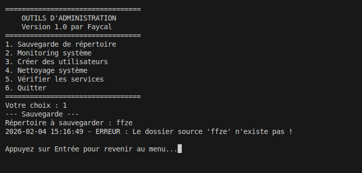


